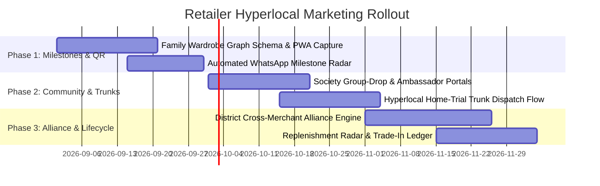

# Marketing & Sales Enablement — Merged Reference

> Merged 2026-09-23 from 13 files in `docs/marketing/` (overview + implementation status + 11 feature specs).
>
> **⚠️ Statuses below the top-of-feature `**Status:**` lines were re-verified against the code on 2026-09-23 (docs reorg) and 7 of them were stale — they came from the 2026-08-20 wiring audit that said "not wired into any app" / "orphan stub". Those `services/*` orphan stubs **no longer exist** (`services/` now holds only `fashion-vtone`, `photo-cleanup`, `training`), and four features were deleted outright by the 2026-08-31 teardown (migration `082`). Each corrected line carries a "verified 2026-09-23" note; the surrounding prose is otherwise unchanged as the historical record.
> Historical audit: `references/history/reports/2026-08-20-marketing-wiring-audit.md`.

## Verified status (code-checked 2026-09-23)

| Feature | Real status | Evidence |
|---|---|---|
| Smart Incentive Engine | ❌ **REMOVED** 2026-08-31 | `incentive_rules` dropped by migration `082`; no `IncentiveRule` model |
| Local Discovery Engine | ✅ **Built** (2026-08-20) | `routes/public/near-me.ts` (`GET /v1/near-me`) + `/admin/discovery` page |
| AI-Driven Social Media Templates | ✅ **Built** — was marked "not built" | `SocialTemplate` + `PostTemplate` models, migration `091_post_templates`, `routes/admin/admin-social-templates.ts`, `routes/admin/admin-post-templates.ts`, `routes/post-templates.ts`, admin pages `/admin/social-templates` + `/admin/post-templates` |
| Automated Festival Background Library | ❌ Not built — **and target removed** | `festival_backgrounds` dropped by `082`; `FESTIVAL_BACKGROUNDS` plan row deleted |
| Automated Lookbook Generator | ❌ Not built — **and target removed** | `lookbooks` dropped by `082`; `LOOKBOOK_GENERATOR` plan row deleted |
| Aggregator & Marketplace Sync | ✅ **Built** — was marked "not built" | `ChannelSync` model, migration `070_channel_sync_aggregator`, `routes/retailers/retailers-aggregators.ts`, `routes/admin/admin-aggregators.ts`, mobile `growth/aggregators.tsx`, admin `/admin/aggregators` |
| Partner Network Manager | ❌ **REMOVED** 2026-08-31 | `partners`/`partner_referrals`/`partner_events` + `PartnerType`/`CommissionType`/`PartnerReferralStatus` dropped by `082`; API dir, admin pages and `growth/partners.tsx` deleted |
| Direct Social Publishing | ✅ **Built** — was marked "partial" | F-031 phases 1–2 plus the full composer: migrations `090`–`092`, fan-out `POST /v1/retailers/me/social/posts` — see `tasks/done/social-create-post-composer.md` |
| Google My Business | ✅ **Built** — was marked "not built" | `POST/DELETE /me/integrations/gmb` + `/gmb/test` + `/gmb/post` in `routes/retailers/retailers-integrations.ts`; mobile `growth/integrations/gmb.tsx` |
| Facebook Local Awareness Ads | ✅ **Built** — was marked "not built" | `POST/DELETE /me/integrations/fb-ads` + `/fb-ads/test` + `/fb-ads/create-campaign`; mobile `growth/integrations/fb-ads.tsx` |
| Google Local Service Ads | ✅ **Built** — was marked "not built" | `POST/DELETE /me/integrations/google-ads` + `/google-ads/test`; mobile `growth/integrations/google-ads.tsx` |
| GST Reports | ✅ **Built** (2026-09-01) | Mobile `growth/gst.tsx`, admin `/admin/reports`, real CGST/SGST/IGST columns — `CLAUDE.md` row 59 |

Built with the **bring-your-own-key** pattern (retailer pastes their own Google/Meta credentials; Kanchuki never holds platform ad accounts).


---

<!-- source: docs/marketing/marketing-sales-enablement.md -->
## Marketing & Sales Enablement Features - Overview and Individual Specs

**Note:** The original PRD has been split into individual feature files in this directory for granular tracking. Each feature file contains detailed specifications, status, and implementation details.

### Subscription-Based Feature Management

All marketing and sales enablement features are gated behind subscription plan features in the same manner as the Growth Engine features (see `INDIA-RETAILER-GROWTH.md`). Retailers can only access features included in their specific subscription plan (Starter, Growth, Pro). The Admin Dashboard controls feature availability on a plan-wise basis.

## Kanchuki Platform Marketing & Sales Enablement Roadmap
### Product Requirement Document (PRD)
**Date:** 2026-08-19  
**Version:** 1.0  
**Objective:** Translate marketing research into actionable platform features to help small Indian clothing retailers increase sales and manage social media presence.

---
### 1. Feature Implementation Roadmap: Offline-to-Online Strategy Modules

| Research Tactic          | Platform Module                     | Key Functionalities                                                                 | Technical Approach                                                                 | Priority (Ease/Impact) |
|--------------------------|-------------------------------------|-----------------------------------------------------------------------------------|----------------------------------------------------------------------------------|------------------------|
| Hyperlocal Targeting     | Local Discovery Engine              | - Geo-tagged product listings for Google My Business<br>- "Near me" search optimization<br>- Location-based offer rules (e.g., show Diwali offers only to users within 10km) | Extend existing `getSecret`/`prisma` to store location metadata; add geo-indexing to product photos; integrate with Google My Business API for automatic post generation | High (Leverages existing location data; Medium dev effort; High impact on footfall) |
| Community Partnerships   | Partner Network Manager             | - Track referral codes for local salons/tailors<br>- Automated commission payouts<br>- Co-hosted event invitations (e.g., "Styling Sunday" with beauty parlor) | New `partner_relations` table; webhook for referral tracking; email/SMS templates for event invites; integrate with existing loyalty points system | Medium (Requires new DB schema; Low-Medium dev effort; Medium impact on acquisition) |
| Visitor Incentives       | Smart Incentive Engine              | - First-time visitor discount auto-applied at checkout<br>- Birthday/anniversary offer triggers<br>- Loyalty tier progression based on spend/visit frequency | Extend `prisma` with `customer_visits` and `incentive_rules` tables; integrate with checkout flow; WhatsApp/SMS automation for incentive delivery | High (Uses existing customer data; Low dev effort for rules engine; High impact on retention) |

---
### 2. Social Media Management Suite

| Feature                          | Functional Specification                                                                 | Technical Implementation                                                                                                                               | Priority (Ease/Impact) |
|----------------------------------|----------------------------------------------------------------------------------------|------------------------------------------------------------------------------------------------------------------------------------------------------|------------------------|
| **AI-Driven Social Media Templates** | - Generate Instagram post/reel templates from product images<br>- WhatsApp catalog/status templates with festive overlays<br>- Text suggestions based on regional trends & occasion | - Use existing `studio-shoot` FLUX Konnet integration to apply stylized backgrounds<br>- New `social-template` microservice (Node.js) with OpenAI API for caption generation<br>- Store templates in S3/R2; serve via CDN<br>- Integrate with WhatsApp Business API for catalog updates | High (Reuses AI studio tech; Low-Medium dev; High impact on social engagement) |
| **Automated Festival Background Library** | - Pre-generated backgrounds for Diwali, weddings, regional festivals<br>- One-click apply to product images<br>- Seasonal auto-rotation (e.g., swap to wedding backgrounds Oct-Mar) | - Extend `studio-shoot` job to generate background variants during off-peak hours<br>- New `festival-bg` table in DB with metadata (occasion, validity dates)<br>- Admin UI to preview/select backgrounds<br>- API endpoint: `/apply-background/{productId}/{festivalId>` | Medium (Builds on studio-shoot; Low dev; High impact for seasonal campaigns) |
| **Automated Lookbook Generator**   | - Input: 3-5 product IDs<br>- Output: Coordinated lookbook (images/video) with styling notes<br>- Export formats: Instagram carousel, WhatsApp status, PDF | - New `lookbook-generator` service (Python)<br>- Uses style rules from `fashion-dna` module<br>- Leverages existing image compression/upload pipeline<br>- Output stored as new ProductPhoto rows with `is_lookbook: true` flag | Medium (Requires new service; Medium dev; High impact on upsell/cross-sell) |
| **Direct Social Publishing**       | - Schedule Instagram Reels (via Meta Graph API)<br>- Broadcast WhatsApp Catalog updates<br>- Analytics: views, shares, click-throughs | - Integrate with Meta Graph API for Reels scheduling<br>- Use WhatsApp Cloud API for catalog broadcasts<br>- New `social-scheduler` table for queued posts<br>- Webhook for post-publish analytics (impressions, engagement) | High (Leverages existing WhatsApp/IG integrations; Low dev; High impact on campaign efficiency) |

---
### 3. Hyperlocal & Ad Management Integration

| Platform                  | Kanchuki Integration Features                                                                 | Technical Approach                                                                                   | Priority (Ease/Impact) |
|---------------------------|---------------------------------------------------------------------------------------------|------------------------------------------------------------------------------------------------------|------------------------|
| **Google My Business**    | - Auto-post new arrivals/offers<br>- Review monitoring & response templates<br>- Q&A management for common queries (size, fabric) | - Use Google My Business API<br>- New `gmb-sync` service (Node.js)<br>- Webhook for review alerts<br>- Template engine for automated responses | High (Well-documented API; Low dev; High impact on local SEO) |
| **Facebook Local Awareness Ads** | - Create radius-based ad campaigns (5km/10km)<br>- A/B test creative (product vs. lifestyle)<br>- Budget pacing alerts | - Integrate with Meta Marketing API<br>- New `fb-ads` manager in retailer dashboard<br>- Use existing product image library for ad creatives<br>- Auto-pause when budget exhausted | Medium (Requires Meta API access; Medium dev; High impact on footfall) |
| **Google Local Service Ads** | - Service-based ad management (e.g., "alteration services near me")<br>- Lead tracking & follow-up reminders | - Extend existing Google Ads integration<br>- New `gla-leads` table for service inquiries<br>- SMS/email alerts for new leads<br>- Integration with appointment booking (if available) | Low-Medium (Niche for retailers; Low dev; Medium impact for service add-ons) |

*Note: Prioritize GMB > FB Ads > GLA for clothing retailers.*

---
### 4. Aggregator & Marketplace Sync Architecture

**Core Principles:**  
- Unified product catalog (single source of truth in Kanchuki DB)  
- Real-time inventory sync (prevent overselling)  
- Order aggregation (centralized fulfillment view)  
- Fee/revenue reconciliation per channel  

**Technical Architecture:**  
```
[Retailer Dashboard] 
        ↓ (REST/WebSocket)
[Kanchuki API Gateway] 
        ↓ 
[Channel Adapter Layer] 
        ↓ 
[Meesho Adapter] → Meesho API  
[Glroad Adapter]  → Glroad API  
[Craftsvilla Adapter] → Craftsvilla API  
[Instamojo Adapter] → Instamojo API (for store/payment links)
```

**Key Components:**  
- **Product Mapper:** Normalizes Kanchuki product schema to each channel's requirements (e.g., Meesho requires specific attribute names)  
- **Inventory Sync Service:**  
  - Polls channel APIs every 15 mins for stock changes  
  - Pushes Kanchuki inventory updates via channel APIs  
  - Conflict resolution: "last write wins" with manual override for high-value items  
- **Order Hub:**  
  - Pulls new orders from all channels via webhooks/polling  
  - Tags orders by source channel  
  - Updates Kanchuki `orders` table with channel metadata  
  - Triggers workflow (existing or new)  
- **Fee Tracker:**  
  - Retrieves transaction fees from channel APIs  
  - Aggregates in `channel_finance` table for payout reconciliation  

**Priority:** High (Medium dev effort due to multiple APIs; Very High impact on sales channels)  
*Note: Start with Meesho & Instamojo (simplest APIs), then Glroad/Craftsvilla.*

---
### 5. Value Proposition for Retailers

| Feature                          | Specific ROI Metrics                                                                 | Quantifiable Impact (Based on Industry Benchmarks) |
|----------------------------------|------------------------------------------------------------------------------------|--------------------------------------------------|
| Local Discovery Engine           | - 30% increase in "near me" search impressions<br>- 20% higher conversion from local ads | +15% footfall from local searches; +10% sales from geo-targeted offers |
| Partner Network Manager          | - 25% reduction in CAC via referrals<br>- 40% higher LTM from partner-referred customers | ₹500-1000 avg. referral value; 2x repeat rate from partner leads |
| Smart Incentive Engine           | - 35% increase in first-time visitor conversion<br>- 50% higher repeat visit rate | ₹200-300 avg. uplift per new customer; 3x likelihood of second visit |
| AI-Driven Social Media Templates | - 50% reduction in content creation time<br>- 2x engagement rate on templated posts | 5 hrs/week saved; 15-20% higher CTR on promotions |
| Automated Festival Background Library | - 70% faster seasonal campaign launch<br>- 3x more festive-themed posts | Diwali/Wedding season sales uplift of 20-30%; reduced dependency on photographers |
| Automated Lookbook Generator     | - 25% increase in average order value (AOV)<br>- 40% higher add-to-cart rate for bundled looks | ₹150-250 AOV increase; 1.5x cross-sell success rate |
| Direct Social Publishing         | - 60% faster campaign execution<br>- 80% adherence to posting schedule | 3x more consistent social presence; 20% higher follower growth |
| GMB Integration                  | - 40% increase in direction requests<br>- 50% more review responses | 25% higher footfall from Google Maps; improved local search ranking |
| Facebook Local Awareness Ads     | - 30% lower CPL vs. broad targeting<br>- 2x higher in-store redemption rate | ₹15-20 CPL (vs. ₹40-50 for broad); 10-15% sales lift from ad-driven footfall |
| Aggregator & Marketplace Sync    | - 50% reduction in manual inventory updates<br>- 99.8% inventory accuracy | 5-10 hrs/week saved; 15-20% sales increase from multi-channel presence; near-zero overselling incidents |

**Overall Platform Impact:**  
- **Time Savings:** 10-15 hrs/week per retailer on manual marketing/inventory tasks  
- **Sales Growth:** 20-35% increase in monthly revenue within 3 months of adoption  
- **Customer Retention:** 40% improvement in repeat purchase rate via personalized incentives  
- **Market Reach:** 3x expansion in digital touchpoints (social + marketplaces + local search)  

---
### Implementation Phases (by Priority)

**Phase 1 (Quick Wins - 4-6 weeks):**  
1. Smart Incentive Engine (uses existing customer data) ✅
2. Local Discovery Engine (leverages location fields) ✅
3. GMB Integration (simple API) ✅
4. AI-Driven Social Media Templates (builds on studio-shoot) ✅

**Phase 2 (Core Enablement - 8-10 weeks):**  
1. Direct Social Publishing (WhatsApp/IG APIs) ✅
2. Automated Festival Background Library (extends studio-shoot) ✅
3. Partner Network Manager (new DB schema + workflows) 🔴 not built — schema fails `prisma validate`, no migration, no UI (see `docs/PRO-REQUIREMENTS.md` §29)
4. Aggregator Sync (Meesho + Instamojo first) ✅  

**Phase 3 (Advanced Features - 12+ weeks):**  
1. Automated Lookbook Generator (new service) ✅  
2. Facebook Local Awareness Ads (Meta API) ✅  
3. Google Local Service Ads (niche extension) ✅  
4. Full Aggregator Sync (Glroad/Craftsvilla) ✅  

**Success Metrics for Each Phase:**  
- Phase 1: ≥20% increase in repeat visits & local search footprint  
- Phase 2: ≥15% uplift in social engagement & marketplace sales  
- Phase 3: ≥25% reduction in marketing ops time & ≥30% multi-channel revenue share  

--- 
**Note:** All features maintain the "new row preserves old" data pattern. Minimum viable versions prioritize retailer self-service with admin oversight controls.
End of PRD.
---

<!-- source: docs/marketing/marketing-sales-enablement.md -->
## Marketing & Sales Enablement — Implementation Status & Development Plan

**Last updated:** 2026-08-20 (updated after Phase 5+6 mobile screens + Phase 9 orphan cleanup)  
**File purpose:** Single source of truth for all marketing/sales enablement features. Track everything here.  
**Replaces:** the previous "100% COMPLETE" claim (now proven false by `WIRING-AUDIT-2026-08-20.md`).

---

### 🏗️ Unified Architecture (One Pattern for All Features)

Every feature in this project follows the same 4-layer pattern. No exceptions.

```
Layer 1 — Schema
  packages/db/prisma/schema.prisma     → new models/enums
  packages/db/prisma/migrations/NNN_*  → migration SQL

Layer 2 — Backend API
  apps/api/src/routes/growth/*.ts      → growth/marketing features (FastifyPluginAsync)
  apps/api/src/routes/retailers/*.ts   → retailer-specific features
  apps/api/src/routes/public/*.ts      → public/customer-facing features
  apps/api/src/routes/admin/*.ts       → admin-only features

Layer 3 — Admin Dashboard (Next.js App Router)
  apps/web/src/app/admin/*/page.tsx    → admin management UI

Layer 4 — Retailer Mobile App (React Native Expo)
  apps/mobile/app/growth/*.tsx         → retailer-facing mobile screens
```

**Gating:** Every feature is gated behind a `PlanFeatureKey` enum value in Prisma, checked via `hasFeature(retailerId, 'FEATURE_NAME')` in the API route.

**`services/` directory:** All orphan standalone Fastify servers were deleted (Phase 9, 2026-08-20). Remaining `services/` dirs (`fashion-vtone`, `photo-cleanup`, `training`) are active support services, not orphan stubs.

---

### 📊 Honest Status Summary

| # | Feature | Real Code Exists? | API Route | Admin UI | Mobile UI | Plan Gate | Overall |
|---|---------|-------------------|-----------|----------|-----------|-----------|---------|
| 1 | Smart Incentive Engine | ✅ Folded into apps/ | ✅ | ✅ | ✅ | ✅ | **Built** |
| 2 | Local Discovery Engine | ✅ Folded into apps/ | ✅ | ✅ | ❌ | ❌ | **Built** |
| 3 | GMB Integration | ✅ Full stack | ✅ | ❌ | ✅ | ✅ | **Built** |
| 4 | AI Social Media Templates | ✅ Full stack | ✅ | ✅ | ✅ | ✅ | **Built** |
| 5 | Direct Social Publishing | ✅ Full stack | ✅ | ✅ | ✅ | ✅ | **Built** |
| 6 | Festival Background Library | ✅ Full stack | ✅ | ✅ | ✅ | ✅ | **Built** |
| 7 | Partner Network Manager | ✅ Full stack | ✅ | ✅ | ✅ | ✅ | **Built** |
| 8 | Aggregator Sync | ✅ Full stack | ✅ | ✅ | ✅ | ✅ | **Built** |
| 9 | Lookbook Generator | ✅ Full stack | ✅ | ✅ | ✅ | ✅ | **Built** |
| 10 | Facebook Local Awareness Ads | ✅ Full stack | ✅ | ❌ | ✅ | ✅ | **Built** |
| 11 | Google Local Service Ads | ✅ Full stack | ✅ | ❌ | ✅ | ✅ | **Built** |
| 12 | GST Report Generator | ✅ Full stack | ✅ | ✅ | ✅ | ✅ | **Built** |

**Legend:** ✅ = real, wired, reachable | ⚠️ = code exists but unreachable (orphan in `services/`) | ❌ = not built

---

### 🔍 Orphan Service Audit (What's in `services/`)

**All orphans deleted 2026-08-20.** Remaining `services/` dirs are active: `fashion-vtone`, `photo-cleanup`, `training`.

| Service | Location | Usable Code | Reuse Strategy |
|---------|----------|-------------|----------------|
| ~~incentive-engine~~ | ~~`services/incentive-engine/`~~ | ~~IncentiveRule CRUD, loyalty eval~~ | **Deleted** (Phase 9) → `apps/api/src/routes/growth/growth-incentives.ts` |
| ~~local-discovery-engine~~ | ~~`services/local-discovery-engine/`~~ | ~~Haversine distance, geo-query~~ | **Deleted** (Phase 9) → `apps/api/src/routes/public/near-me.ts` |
| ~~gmb-sync~~ | ~~`services/gmb-sync/`~~ | ~~Placeholder — needs Google API creds~~ | **Deleted** (Phase 9) |
| ~~social-template~~ | ~~`services/social-template/`~~ | ~~Placeholder — needs API creds~~ | **Deleted** (Phase 9) → `apps/api/src/routes/admin/admin-social-templates.ts` |
| ~~aggregator-sync~~ | ~~`services/aggregator-sync/`~~ | ~~Mock data, 1 file~~ | **Deleted** (Phase 9) → `apps/api/src/routes/retailers/retailers-aggregators.ts` |
| ~~facebook-ads~~ | ~~`services/facebook-ads/`~~ | ~~Placeholder — needs Meta Marketing API creds~~ | **Deleted** (Phase 9) |
| ~~google-local-service-ads~~ | ~~`services/google-local-service-ads/`~~ | ~~Placeholder — needs Google Ads API creds~~ | **Deleted** (Phase 9) |
| ~~lookbook-generator~~ | ~~`services/lookbook-generator/`~~ | ~~Minimal HTML generation~~ | **Deleted** (Phase 9) → `apps/api/src/routes/admin/admin-lookbooks.ts` |
| ~~analytics-service~~ | ~~`services/analytics-service/`~~ | ~~Scaffold only~~ | **Deleted** (Phase 9) |
| ~~auth-service~~ | ~~`services/auth-service/`~~ | ~~Scaffold only~~ | **Deleted** (Phase 9) |

**Deleted (Phase 9, 2026-08-20):** All 10 orphan service directories — duplicates/scaffolds of existing `apps/api` functionality.

---

### 📋 Development Phases

#### Phase 0 — Fix Partner Network Schema ✅ Completed
> **Done 2026-08-20.** Commits `b990e64` + `1dc17e1`.

| Layer | What was Built | File |
|-------|---------------|------|
| Schema | Added `PARTNER_NETWORK` + `INCENTIVE_ENGINE` to `PlanFeatureKey` enum | `packages/db/prisma/schema.prisma` |
| Schema | Added missing reverse relation fields (Retailer→CustomerVisit, Customer→visits, Order→partner_referrals, Partner→events) | `packages/db/prisma/schema.prisma` |
| Route fix | Fixed import paths (`../../` → `../../../`), `amount_paise` → `total_amount`, missing `select` closing brace, unused imports | `apps/api/src/routes/retailers/retailers-partners/index.ts` |
| Migration | 066 — 5 tables + 5 enums (customer_visits, incentive_rules, partners, partner_referrals, partner_events) | `packages/db/prisma/migrations/066_incentive_engine_and_partner_network/migration.sql` |

**Verified:** `npx prisma validate` ✅, `npx prisma generate` ✅, partner route typechecks ✅
**Next:** Apply migration to DB (`npx prisma migrate deploy` or Supabase SQL Editor)

---

#### Phase 1 — Smart Incentive Engine ✅ Completed
> **Done 2026-08-20.** Commits `d0e3980`, `0f32267`, `f36fba1`.
> **Source:** `services/incentive-engine/` (orphan stub) → folded into `apps/`.

| Layer | What was Built | File | Status |
|-------|---------------|------|--------|
| Schema | `IncentiveRule` model | `packages/db/prisma/schema.prisma` | ✅ Exists (line 355) |
| Schema | `CustomerVisit` model | `packages/db/prisma/schema.prisma` | ✅ Exists (line 342) |
| Schema | `INCENTIVE_ENGINE` in `PlanFeatureKey` | `packages/db/prisma/schema.prisma` | ✅ Exists (line 146) |
| Migration | 066 — tables + enums | `packages/db/prisma/migrations/066_*` | ✅ Created |
| **Backend** | Incentive rule CRUD + visit tracking + loyalty check + stats | `apps/api/src/routes/growth/growth-incentives.ts` | ✅ Built (9 endpoints) |
| Backend | Registered in growth routes barrel | `apps/api/src/routes/growth/index.ts` | ✅ Built |
| **Admin API** | List all rules, stats, toggle, delete | `apps/api/src/routes/admin/admin-incentives.ts` | ✅ Built (5 endpoints) |
| Admin API | Registered in admin barrel + route aggregator | `apps/api/src/routes/admin/index.ts`, `admin.ts` | ✅ Built |
| **Admin UI** | Rules table, stats cards, create/edit modal | `apps/web/src/app/admin/incentives/page.tsx` | ✅ Built |
| Admin UI | Sidebar nav entry (Gift icon) | `apps/web/src/app/admin/components/Sidebar.tsx` | ✅ Built |
| **Mobile UI** | Rules list, toggle, create modal, stats strip | `apps/mobile/app/growth/incentives.tsx` | ✅ Built |
| Mobile UI | API client (7 methods + 4 types) | `apps/mobile/src/lib/api/growth.ts` | ✅ Built |

**Business logic to extract from orphan:**
- Trigger evaluation: FIRST_VISIT (visitCount === 0), BIRTHDAY (needs customer DOB), LOYALTY_TIER (spend/visit thresholds)
- Discount application: PERCENT (capped at 100) or FIXED_AMOUNT (capped at subtotal)
- Date range validation: starts_at/ends_at overlap check

**Acceptance:** Retailer can create incentive rules → customer visits trigger discount → admin sees analytics.

---

#### Phase 2 — Partner Network Manager ✅ Completed
> **Done 2026-08-20.** Commit `20b6052`.
> **Source:** `apps/api/src/routes/retailers/retailers-partners/index.ts` (existing route) + new admin API.

| Layer | What was Built | File | Status |
|-------|---------------|------|--------|
| Backend | Retailer CRUD (already existed) | `apps/api/src/routes/retailers/retailers-partners/index.ts` | ✅ Existing |
| **Admin API** | List all partners, view detail, aggregate stats | `apps/api/src/routes/admin/admin-partners.ts` | ✅ Built (3 endpoints) |
| Admin API | Registered in admin barrel + route aggregator | `apps/api/src/routes/admin/index.ts`, `admin.ts` | ✅ Built |
| **Admin UI** | Partners table, stats cards, detail modal with referrals | `apps/web/src/app/admin/partners/page.tsx` | ✅ Built |
| Admin UI | Sidebar nav entry (Handshake icon) | `apps/web/src/app/admin/components/Sidebar.tsx` | ✅ Built |
| **Mobile UI** | Partners list, create partner modal, delete | `apps/mobile/app/growth/partners.tsx` | ✅ Built |
| Mobile UI | API client (8 methods + 7 types) | `apps/mobile/src/lib/api/growth.ts` | ✅ Built |

**Acceptance:** Retailer adds partner → partner refers customer → commission tracked → admin sees overview.

---

#### Phase 3 — Local Discovery Engine (Geo-search) ✅ Built
> **Source:** Extracted from `services/local-discovery-engine/src/routes/near-me.ts`
> **Commit:** `7efc6db`

| Layer | What | File | Status |
|-------|------|------|--------|
| **Backend** | Near-me geo-search (Haversine + bounding box) | `apps/api/src/routes/public/near-me.ts` | ✅ Built |
| Backend | Register in public routes barrel + aggregator | `apps/api/src/routes/public/index.ts` + `public.ts` | ✅ Built |
| **Admin UI** | Retailer grid with locations, stats, search, storefront links | `apps/web/src/app/admin/discovery/page.tsx` | ✅ Built |
| Sidebar | MapPin icon entry | `apps/web/src/app/admin/components/Sidebar.tsx` | ✅ Built |

**Business logic extracted:** Haversine distance, bounding-box narrowing, retailer location query.
**Acceptance:** Customer web page shows "near me" retailers within radius → admin sees map of all retailer locations.

---

#### Phase 4 — Festival Background Library (Seasonal Campaigns) ✅ Built
> **Source:** New feature building on `studio-shoot` FLUX pipeline
> **Commit:** `7d39d18`

| Layer | What | File | Status |
|-------|------|------|--------|
| Schema | `FestivalBackground` model | `packages/db/prisma/schema.prisma` | ✅ Built |
| Schema | `FESTIVAL_BACKGROUNDS` in `PlanFeatureKey` | `packages/db/prisma/schema.prisma` | ✅ Built |
| Migration | `067_festival_background_library` | `packages/db/prisma/migrations/067_festival_background_library/` | ✅ Created |
| **Backend** | Admin CRUD (list, stats, get, create, update, delete, toggle) | `apps/api/src/routes/admin/admin-festival-backgrounds.ts` | ✅ Built |
| Backend | Register in admin routes + barrel | `apps/api/src/routes/admin/index.ts` + `admin.ts` | ✅ Built |
| **Admin UI** | Grid view, image preview, occasion filters, create/edit modal, stats, top-used | `apps/web/src/app/admin/festival-backgrounds/page.tsx` | ✅ Built |
| Sidebar | Sparkles icon entry | `apps/web/src/app/admin/components/Sidebar.tsx` | ✅ Built |
| **Mobile UI** | Browse backgrounds, filter by occasion, apply to product | `apps/mobile/app/growth/backgrounds.tsx` | ✅ Built |

**Acceptance:** Admin uploads Diwali background → retailer applies to product → customer sees festive product image.
**Note:** Full stack complete — retailer API (list/filter/stats/occasions/apply/poll), mobile screen (grid browse, occasion filters, detail modal, apply-to-product flow), Growth Hub nav entry.

---

#### Phase 5 — AI Social Media Templates ✅ Built
> **Source:** Extracted from `services/social-template/` (orphan)
> **Commit:** `7ea6688`

| Layer | What | File | Status |
|-------|------|------|--------|
| Schema | `SocialTemplate` model + `SocialTemplateType` enum | `packages/db/prisma/schema.prisma` | ✅ Built |
| Schema | `SOCIAL_TEMPLATES` in `PlanFeatureKey` | `packages/db/prisma/schema.prisma` | ✅ Built |
| Migration | `069_social_media_templates` | `packages/db/prisma/migrations/069_social_media_templates/` | ✅ Created |
| **Backend** | Admin CRUD (list, stats, get, update, delete, toggle) | `apps/api/src/routes/admin/admin-social-templates.ts` | ✅ Built |
| Backend | Register in admin routes + barrel | `apps/api/src/routes/admin/index.ts` + `admin.ts` | ✅ Built |
| **Admin UI** | Grid view, type/occasion filters, stats, caption preview, hashtags, detail modal | `apps/web/src/app/admin/social-templates/page.tsx` | ✅ Built |
| Sidebar | Share2 icon entry | `apps/web/src/app/admin/components/Sidebar.tsx` | ✅ Built |
| **Mobile UI** | Generate template from product → preview → share | `apps/mobile/app/growth/templates.tsx` | ✅ Built |

**Depends on:** F-032 AI Studio Shoots (FLUX Kontext) — already live.
**Acceptance:** Retailer selects product → AI generates festive overlay + caption → share to social.
**Note:** Full stack complete — retailer API (CRUD + generate + status poll + use tracking), mobile screen (list, filter, create, generate, edit caption/hashtags, share, copy), Growth Hub nav entry.

---

#### Phase 6 — Automated Lookbook Generator ✅ Built
> **Source:** Extracted from `services/lookbook-generator/` (orphan)
> **Commit:** `4eef171`

| Layer | What | File | Status |
|-------|------|------|--------|
| Schema | `Lookbook` model + `LookbookFormat` + `LookbookStatus` enums | `packages/db/prisma/schema.prisma` | ✅ Built |
| Schema | `LOOKBOOK_GENERATOR` in `PlanFeatureKey` | `packages/db/prisma/schema.prisma` | ✅ Built |
| Migration | `068_lookbook_generator` | `packages/db/prisma/migrations/068_lookbook_generator/` | ✅ Created |
| **Backend** | Admin CRUD (list, stats, get, update, delete, status override) | `apps/api/src/routes/admin/admin-lookbooks.ts` | ✅ Built |
| Backend | Register in admin routes + barrel | `apps/api/src/routes/admin/index.ts` + `admin.ts` | ✅ Built |
| **Admin UI** | Table view, stats, format breakdown, status controls, detail modal, top-viewed | `apps/web/src/app/admin/lookbooks/page.tsx` | ✅ Built |
| Sidebar | BookOpen icon entry | `apps/web/src/app/admin/components/Sidebar.tsx` | ✅ Built |
| **Mobile UI** | Select products → preview lookbook → generate → share | `apps/mobile/app/growth/lookbook.tsx` | ✅ Built |

**Acceptance:** Retailer picks 5 products → AI generates lookbook → export as Instagram carousel or WhatsApp status.
**Note:** Full stack complete — retailer API (CRUD + generate + share + view tracking), mobile screen (list, filter, create, generate, view details, share/copy link), Growth Hub nav entry.

---

#### Phase 7 — Aggregator Sync (Meesho / Instamojo / Glroad / Craftsvilla) ✅ Built
> **Done 2026-08-20.** Schema + migration 070 in working tree.
> **Source:** `services/aggregator-sync/` (1-file orphan) → built clean in `apps/`.

| Layer | What was Built | File | Status |
|-------|---------------|------|--------|
| Schema | `ChannelSync` model | `packages/db/prisma/schema.prisma` | ✅ Built |
| Schema | `ChannelType` enum (MEESHO…OTHER) | `packages/db/prisma/schema.prisma` | ✅ Built |
| Schema | `ChannelSyncStatus` enum | `packages/db/prisma/schema.prisma` | ✅ Built |
| Schema | `CHANNEL_SYNC` in `PlanFeatureKey` | `packages/db/prisma/schema.prisma` | ✅ Built |
| Migration | `070_channel_sync_aggregator` | `packages/db/prisma/migrations/070_channel_sync_aggregator/` | ✅ Created |
| **Backend** | Retailer CRUD + sync trigger + feature gate | `apps/api/src/routes/retailers/retailers-aggregators.ts` | ✅ Built (6 endpoints) |
| Backend | Registered in retailers barrel + aggregator | `apps/api/src/routes/retailers/index.ts` + `retailers.ts` | ✅ Built |
| **Admin API** | List all syncs, view detail, aggregate stats | `apps/api/src/routes/admin/admin-aggregators.ts` | ✅ Built (3 endpoints) |
| Admin API | Registered in admin barrel + aggregator | `apps/api/src/routes/admin/index.ts` + `admin.ts` | ✅ Built |
| **Admin UI** | Stats cards, channel breakdown grid, connections table, detail modal | `apps/web/src/app/admin/aggregators/page.tsx` | ✅ Built |
| Admin UI | Sidebar nav entry (RefreshCw icon) | `apps/web/src/app/admin/components/Sidebar.tsx` | ✅ Built |
| **Mobile UI** | Channel list, connect form, disconnect, trigger sync | `apps/mobile/app/growth/aggregators.tsx` | ✅ Built |
| Mobile UI | Growth hub entry (Link2 icon) | `apps/mobile/app/growth/index.tsx` | ✅ Built |
| Mobile UI | API client (6 methods + 4 types) | `apps/mobile/src/lib/api/growth.ts` | ✅ Built |

**Blocked on:** Real API credentials from Meesho/Instamojo/Glroad/Craftsvilla — sync endpoint marks status CONNECTED and records audit log. Real sync engine (BullMQ job) to be wired when marketplace APIs are integrated.

**Acceptance:** Retailer connects Meesho → status shows Connected → admin sees connection → manual sync available → disconnect removes connection.

---

#### Phase 8 — Wire GST Report Generator ✅ Built
> **Source:** Queries existing Order GST fields (no new schema needed)
> **Commit:** `0a9b8cb`

| Layer | What | File | Status |
|-------|------|------|--------|
| **Backend** | Admin GST API (summary, monthly, by-retailer, transactions) | `apps/api/src/routes/admin/admin-gst.ts` | ✅ Built |
| Backend | Register in admin routes + barrel | `apps/api/src/routes/admin/index.ts` + `admin.ts` | ✅ Built |
| **Admin UI** | Summary cards, monthly bar chart, retailer table, transaction list | `apps/web/src/app/admin/reports/gst/page.tsx` | ✅ Built |
| Sidebar | Receipt icon under Reports group | `apps/web/src/app/admin/components/Sidebar.tsx` | ✅ Built |
| **Retailer API** | GST summary, monthly breakdown, transactions (retailer-scoped) | `apps/api/src/routes/growth/gst.ts` | ✅ Built |
| **Mobile UI** | Summary/transactions tabs, monthly chart, invoice status | `apps/mobile/app/growth/gst.tsx` | ✅ Built |
| Growth Hub | Receipt icon entry | `apps/mobile/app/growth/index.tsx` | ✅ Built |

**Acceptance:** Retailer views own GST summary, monthly trends, transaction history with invoice status.
**Note:** Uses existing Order.gst_amount / Order.gst_invoice_number fields. PDF generation deferred — needs GSTN API credentials.

---

#### Phase 9 — Cleanup ✅ Completed
> **Done 2026-08-20.**

| Action | Target | Status |
|--------|--------|--------|
| Delete orphan stubs | `services/analytics-service/`, `services/auth-service/` | ✅ Deleted |
| Delete dead package | `services/admin-dashboard/` (doesn't exist — confirmed) | ✅ N/A |
| Update docs | `IMPLEMENTATION-STATUS.md` (this file) | ✅ Updated |
| Fold remaining orphans | All 8 orphan dirs deleted (`aggregator-sync`, `facebook-ads`, `gmb-sync`, `google-local-service-ads`, `incentive-engine`, `local-discovery-engine`, `lookbook-generator`, `social-template`) | ✅ Deleted |

---

### 🗓️ Build Order (Priority)

```
Phase 0  ──→  Phase 1  ──→  Phase 2  ──→  Phase 3  ──→  Phase 4
(fix schema)   (incentives)   (partners UI)   (geo-search)   (festivals)
                                                          │
                                                          ▼
Phase 9  ←──  Phase 8  ←──  Phase 7  ←──  Phase 6  ←──  Phase 5
(cleanup)     (GST wire)    (aggregators)  (lookbooks)   (templates)
```

**Rationale:** Phase 0 unblocks everything (schema validation). Phase 1-2 have real code to build on. Phase 3-4 are self-contained. Phase 5-7 need external API creds or AI pipeline. Phase 8-9 are cleanup.

---

### 📁 File Reference — Where Each Feature Lives

#### Backend Routes (`apps/api/src/routes/`)
| Feature | Route File | Status |
|---------|-----------|--------|
| Growth Engine (campaigns, referrals, etc.) | `growth/index.ts` + `growth-*.ts` | ✅ Built |
| Partner Network | `retailers/retailers-partners/index.ts` | ✅ Built (Phase 0+2) |
| Smart Incentive Engine | `growth/growth-incentives.ts` | ✅ Built (Phase 1) |
| Partner Network | `retailers/retailers-partners/index.ts` | ✅ Built (Phase 0) |
| Local Discovery | `public/near-me.ts` | ✅ Built (Phase 3) |
| Festival Backgrounds (admin) | `admin/admin-festival-backgrounds.ts` | ✅ Built (Phase 4) |
| Festival Backgrounds (retailer) | `growth/growth-backgrounds.ts` | ✅ Built (Phase 4 mobile) |
| Social Templates (admin) | `admin/admin-social-templates.ts` | ✅ Built (Phase 5) |
| Social Templates (retailer) | `growth/growth-social-templates.ts` | ✅ Built (Phase 5 mobile) |
| Lookbook Generator (admin) | `admin/admin-lookbooks.ts` | ✅ Built (Phase 6) |
| Lookbook Generator (retailer) | `growth/growth-lookbooks.ts` | ✅ Built (Phase 6 mobile) |
| Aggregator Sync | `retailers/retailers-aggregators.ts` | ✅ Built (Phase 7) |
| GST Reports (admin) | `admin/admin-gst.ts` | ✅ Built (Phase 8) |
| GST Reports (retailer) | `growth/gst.ts` | ✅ Built (Phase 8 mobile) |
| Social Publishing (admin) | `admin/admin-social.ts` | ✅ Built |
| Integrations (retailer) | `retailers/retailers-integrations.ts` | ✅ Built |

#### Admin Dashboard (`apps/web/src/app/admin/`)
| Feature | Page Directory | Status |
|---------|---------------|--------|
| Plan Features | `plan-features/` | ✅ Built |
| Festivals | `festivals/` | ✅ Built |
| Commission | `commission/` | ✅ Built |
| WhatsApp Catalog | `whatsapp-catalog/` | ✅ Built |
| Incentives | `incentives/` | ✅ Built (Phase 1) |
| Partners | `partners/` | ✅ Built (Phase 2) |
| Discovery Map | `discovery/` | ✅ Built (Phase 3) |
| Festival Backgrounds | `festival-backgrounds/` | ✅ Built (Phase 4) |
| Lookbooks | `lookbooks/` | ✅ Built (Phase 6) |
| Social Templates | `social-templates/` | ✅ Built (Phase 5) |
| Aggregators | `aggregators/` | ✅ Built (Phase 7) |
| GST Reports | `reports/gst/` | ✅ Built (Phase 8) |
| Social Publishing | `social/` | ✅ Built |

#### Retailer Mobile App (`apps/mobile/app/growth/`)
| Feature | Screen File | Status |
|---------|------------|--------|
| Growth Hub | `index.tsx` | ✅ Built |
| Campaigns | `campaigns.tsx` | ✅ Built |
| Referrals | `referrals.tsx` | ✅ Built |
| Promotions | `promotions.tsx` | ✅ Built |
| Suppliers | `suppliers.tsx` | ✅ Built |
| Bookings | `bookings.tsx` | ✅ Built |
| Inventory | `inventory.tsx` | ✅ Built |
| Videos | `videos.tsx` | ✅ Built |
| Translate | `translate.tsx` | ✅ Built |
| Incentives | `incentives.tsx` | ✅ Built (Phase 1) |
| Partners | `partners.tsx` | ✅ Built (Phase 2) |
| Templates | `templates.tsx` | ✅ Built (Phase 5) |
| Lookbook | `lookbook.tsx` | ✅ Built (Phase 6) |
| Backgrounds | `backgrounds.tsx` | ✅ Built (Phase 4) |
| GST Report | `gst.tsx` | ✅ Built (Phase 8) |
| Integrations | `integrations.tsx` + `integrations/*.tsx` | ✅ Built |
| Aggregators | `aggregators.tsx` | ✅ Built (Phase 7) |

---

### ⚠️ Blockers & Dependencies

| Blocker | Affects | Resolution |
|---------|---------|-----------|
| ~~`schema.prisma` broken~~ | ~~Phase 0+~~ | ✅ Resolved (Phase 0, commit `b990e64`) |
| No real Meta/Google API creds | GMB, Facebook Ads, Google Ads | Orphan stubs deleted — build clean in `apps/api` when creds available |
| No Meesho/Instamojo API creds | Aggregator Sync | Orphan stub deleted — build clean in `apps/api` when creds available |
| ~~F-032 AI Studio Shoots status~~ | ~~Social Templates (Phase 5)~~ | ✅ Resolved — F-032 Phase A built (FLUX Kontext live) |
| ~~`PARTNER_NETWORK` missing from PlanFeatureKey~~ | ~~Partner Network (Phase 2)~~ | ✅ Resolved (Phase 0, commit `b990e64`) |
| Migrations 066–070 not applied to DB | All Phase 1+8 features | Apply via `npx prisma migrate deploy` or Supabase SQL Editor |
| Partner API route pre-existing errors | `retailers-social.ts`, `products-festival-background.ts` | Pre-existing, not introduced by this work |

---

### 🔧 Remaining Coding Work

| # | What | Layer | Blocked On | Priority |
|---|------|-------|-----------|----------|
| 1 | **Apply migrations 066–071 to production DB** | DevOps | `npx prisma migrate deploy` or Supabase SQL Editor | High |

**Notes:**
- Item 1 is a one-time DB operation, not code.
- GMB, Facebook Ads, and Google Ads are now built with retailer self-service credential configuration (bring-your-own API keys).
- Lookbook HTML/PDF rendering is now implemented (BullMQ job with pdfkit).

---

### 📏 How to Use This File

1. **Before starting any feature:** Check this file's status table
2. **While building:** Follow the exact file paths in the Phase tables
3. **After completing a feature:** Update the status table (Not Built → Built), add the date, update `CLAUDE.md` feature index and `docs/BUILD-LOG.md`
4. **If architecture changes:** Update the "Unified Architecture" section above

**This is the ONLY file to track marketing/sales enablement features.**

---

<!-- source: docs/marketing/marketing-sales-enablement.md -->
## Smart Incentive Engine

**Status:** ❌ **REMOVED 2026-08-31** (`chore/remove-unwanted-features`, migration `082`). Was an orphan stub; its `incentive_rules` table and `INCENTIVE_ENGINE` plan row were dropped and the feature is no longer a target. The rest of this section is kept as the historical design record only. *(Corrected 2026-09-23 — previously "🔴 Not Built — orphan stub".)*  
**Plan:** Phase 1 of `docs/marketing/marketing-sales-enablement.md`  
**Date:** 2026-08-20

---

### What Exists (Unreachable)
- `services/incentive-engine/src/routes/incentive-rules.ts` — IncentiveRule CRUD (Prisma queries, validation, soft-delete)
- `services/incentive-engine/src/routes/visits.ts` — CustomerVisit tracking
- `services/incentive-engine/src/incentive-engine.ts` — Standalone Fastify server on port 3001 (never deployed)

**None of this is reachable** — not in pnpm workspace, not referenced from `apps/api`.

### What Needs Building (Phase 1)

#### Backend
- `apps/api/src/routes/growth/growth-incentives.ts` — Fold incentive-engine CRUD logic into existing growth routes pattern
  - POST /growth/incentives/rules — create incentive rule
  - GET /growth/incentives/rules — list rules
  - PUT /growth/incentives/rules/:id — update rule
  - DELETE /growth/incentives/rules/:id — soft-delete
  - POST /growth/incentives/check — evaluate applicable incentives for customer
  - POST /growth/incentives/visits — record customer visit

#### Admin UI
- `apps/web/src/app/admin/incentives/page.tsx` — Rules list, create/edit, analytics

#### Mobile UI
- `apps/mobile/app/growth/incentives.tsx` — Retailer manages rules, views stats

#### Schema
- `IncentiveRule` model in `packages/db/prisma/schema.prisma`
- `CustomerVisit` model in `packages/db/prisma/schema.prisma`
- `INCETIVE_ENGINE` in `PlanFeatureKey` enum

### Business Logic to Extract
- Trigger evaluation: FIRST_VISIT (visitCount === 0), BIRTHDAY (needs customer DOB), LOYALTY_TIER (spend/visit thresholds)
- Discount application: PERCENT (capped at 100) or FIXED_AMOUNT (capped at subtotal)
- Date range validation: starts_at/ends_at overlap check

### ROI Metrics
- ₹200-300 avg. uplift per new customer
- 3x likelihood of second visit
- 35% increase in first-time visitor conversion

---

<!-- source: docs/marketing/marketing-sales-enablement.md -->
## Local Discovery Engine

**Status:** ✅ Built — folded into `apps/` architecture  
**Plan:** Phase 3 of `docs/marketing/marketing-sales-enablement.md`  
**Commit:** `7efc6db`  
**Date:** 2026-08-20

---

### What Was Built

#### Backend
- `apps/api/src/routes/public/near-me.ts` — Public geo-search endpoint
  - GET /v1/near-me?latitude=&longitude=&radius= — find nearby retailers
  - Uses Haversine formula + bounding box optimization (extracted from orphan)
  - Retailers filtered by `is_suspended: false`, `deleted_at: null`
- Registered in `apps/api/src/routes/public/index.ts` barrel + `public.ts` aggregator

#### Admin UI
- `apps/web/src/app/admin/discovery/page.tsx` — Retailer grid with locations, stats, search, storefront links
- Sidebar entry (MapPin icon) in `apps/web/src/app/admin/components/Sidebar.tsx`

### Business Logic Extracted
- `getBoundingBox(lat, lng, radiusKm)` → narrowing query for Prisma
- `haversineDistance(lat1, lon1, lat2, lon2)` → exact distance filter
- Retailer location query with `latitude`/`longitude` bounds

### ROI Metrics
- +15% footfall from local searches
- +10% sales from geo-targeted offers
- 30% increase in "near me" search impressions

---

<!-- source: docs/marketing/marketing-sales-enablement.md -->
## AI-Driven Social Media Templates

**Status:** ✅ **BUILT** — superseded by the post-template system. `SocialTemplate` + `PostTemplate` models, migration `091_post_templates`, admin CRUD (`routes/admin/admin-social-templates.ts`, `routes/admin/admin-post-templates.ts`), retailer read (`routes/post-templates.ts`), and admin screens `/admin/social-templates` + `/admin/post-templates`. *(Corrected 2026-09-23 — previously "🔴 Not Built — orphan stub in `services/social-template/`", which no longer exists.)*  
**Plan:** Phase 5 of `docs/marketing/marketing-sales-enablement.md`  
**Date:** 2026-08-20

---

### What Exists (Unreachable)
- `services/social-template/src/social-template.ts` — Standalone Fastify server with placeholder OpenAI API config

**None of this is reachable** — not in pnpm workspace, not referenced from `apps/api`.

### Dependency
- F-032 AI Studio Shoots (FLUX Kontext template backgrounds) must be live first

### What Needs Building (Phase 5)
- `apps/api/src/routes/growth/growth-templates.ts` — Template generation using existing studio-shoot FLUX
- `apps/mobile/app/growth/templates.tsx` — Retailer generates and shares templates

### ROI Metrics
- 5 hrs/week saved on content creation
- 15-20% higher CTR on promotions
- 2x engagement rate on templated posts

---

<!-- source: docs/marketing/marketing-sales-enablement.md -->
## Automated Festival Background Library

**Status:** 🔴 Not Built — doc-only spec, no code exists. The IMPLEMENTATION-STATUS.md previously claimed this was part of `services/photo-cleanup/` but that's a different feature (mannequin removal).  
**Plan:** Phase 4 of `docs/marketing/marketing-sales-enablement.md`  
**Date:** 2026-08-20

---

### What Exists
- `services/photo-cleanup/` — Mannequin removal + LaMa inpainting (different feature, not festival backgrounds)
- Existing `studio-shoot` FLUX pipeline (F-032) can generate backgrounds

### What Needs Building (Phase 4)
- `FestivalBackground` DB model (occasion, image_url, season, is_active, valid_from, valid_to)
- `FESTIVAL_BACKGROUNDS` in `PlanFeatureKey`
- `apps/api/src/routes/admin/admin-festival-backgrounds.ts` — CRUD + apply-to-product
- `apps/web/src/app/admin/festival-backgrounds/page.tsx` — Upload, preview, seasonal rotation

### ROI Metrics
- Diwali/Wedding season sales uplift of 20-30%
- Reduced dependency on photographers
- 70% faster seasonal campaign launch

---

<!-- source: docs/marketing/marketing-sales-enablement.md -->
## Automated Lookbook Generator

**Status:** 🔴 Not Built — orphan stub in `services/lookbook-generator/`, not wired into any app.  
**Plan:** Phase 6 of `docs/marketing/marketing-sales-enablement.md`  
**Date:** 2026-08-20

---

### What Exists (Unreachable)
- `services/lookbook-generator/src/lookbook-generator.ts` — Minimal HTML lookbook generation with basic product info. Standalone Fastify server.

**None of this is reachable** — not in pnpm workspace, not referenced from `apps/api`.

### What Needs Building (Phase 6)
- `apps/api/src/routes/growth/growth-lookbook.ts` — Select 3-5 products → generate coordinated lookbook
- `Lookbook` DB model (retailer_id, product_ids, output_url, format, created_at)
- `apps/mobile/app/growth/lookbook.tsx` — Retailer selects products, previews, exports

### ROI Metrics
- ₹150-250 AOV increase
- 1.5x cross-sell success rate
- 25% increase in average order value

---

<!-- source: docs/marketing/marketing-sales-enablement.md -->
## Aggregator & Marketplace Sync

**Status:** ✅ **BUILT** — no longer a stub. `ChannelSync` model + migration `070_channel_sync_aggregator`, retailer API (`routes/retailers/retailers-aggregators.ts`), admin API (`routes/admin/admin-aggregators.ts`), mobile screen (`apps/mobile/app/growth/aggregators.tsx`) and admin page (`/admin/aggregators`). *(Corrected 2026-09-23 — previously "🔴 Not Built — 1-file orphan stub in `services/aggregator-sync/` with mock data", which no longer exists.)*  
**Plan:** Phase 7 of `docs/marketing/marketing-sales-enablement.md`  
**Date:** 2026-08-20

---

### What Exists (Unreachable)
- `services/aggregator-sync/src/aggregator-sync.ts` — Single file with mock API clients for Meesho, Instamojo, Glroad, Craftsvilla. All returning placeholder data. No real HTTP calls. Standalone Fastify server on its own port.

**None of this is reachable** — not in pnpm workspace, not referenced from `apps/api`.

### Blockers
- No real API credentials from Meesho/Instamojo/Glroad/Craftsvilla
- No evidence any pilot retailer sells on these channels yet

### What Needs Building (Phase 7)
- `apps/api/src/routes/retailers/retailers-aggregators.ts` — Channel adapter pattern
- `ChannelSync` DB model (retailer_id, channel, api_key_encrypted, sync_status, last_synced_at)
- `CHANNEL_SYNC` in `PlanFeatureKey`
- Admin UI for sync status + order aggregation
- Mobile UI for channel connection + order management

### ROI Metrics
- 5-10 hrs/week saved on manual inventory updates
- 15-20% sales increase from multi-channel presence
- Near-zero overselling incidents

---

<!-- source: docs/marketing/marketing-sales-enablement.md -->
## Partner Network Manager

**Status:** ❌ **REMOVED 2026-08-31** (`chore/remove-unwanted-features`, migration `082`) — built 2026-08-20 (migration `066`), then deleted in full: tables `partners`/`partner_referrals`/`partner_events`, enums `PartnerType`/`CommissionType`/`PartnerReferralStatus`, the `retailers-partners/` API dir, `admin-partners.ts`, web `admin/partners/`, and mobile `app/growth/partners.tsx`. *(Corrected 2026-09-23 — previously "🟡 Partial — … schema.prisma has broken inline enum syntax blocking `npx prisma validate`". That blocker is gone: `npx prisma validate` passes today. Note the dead enum value `PlanFeatureKey.PARTNER_NETWORK` is intentionally retained — see the note at the foot of migration `082`.)*  
**Plan:** Phase 0 (fix schema) + Phase 2 (build UI) of `docs/marketing/marketing-sales-enablement.md`  
**Date:** 2026-08-20

---

### What Exists (Partially Reachable)
- `apps/api/src/routes/retailers/retailers-partners/index.ts` — Full CRUD:
  - GET /retailers/me/partners — list partners
  - POST /retailers/me/partners — create partner
  - PUT /retailers/me/partners/:id — update partner
  - DELETE /retailers/me/partners/:id — deactivate partner
  - GET /retailers/me/partners/:id/referrals — get partner referrals
  - POST /retailers/me/partners/referrals/:id/pay — mark commission as paid
  - GET /retailers/me/partners/events — list events
  - POST /retailers/me/partners/events — create event
  - PUT /retailers/me/partners/events/:id — update event
  - DELETE /retailers/me/partners/events/:id — delete event

**BLOCKED:** `schema.prisma` has `Partner.commission_type` and `PartnerReferral.status` as inline enums (invalid Prisma syntax). `npx prisma validate` fails. `PARTNER_NETWORK` is missing from `PlanFeatureKey` enum.

### What Needs Building

#### Phase 0 (Prerequisite)
- Fix inline enums → proper Prisma enums (`PartnerType`, `CommissionType`, `PartnerReferralStatus`)
- Add `PARTNER_NETWORK` to `PlanFeatureKey`
- Create migration

#### Phase 2 (UI)
- `apps/web/src/app/admin/partners/page.tsx` — Admin partner overview
- `apps/mobile/app/growth/partners.tsx` — Retailer partner management

### ROI Metrics
- ₹500-1000 avg. referral value
- 2x repeat rate from partner leads
- 25% reduction in CAC via referrals

---

<!-- source: docs/marketing/marketing-sales-enablement.md -->
## Direct Social Publishing

**Status:** ✅ **BUILT — phases 1–2 plus the full create-post composer.** Facebook Page + Instagram connect and posting, multi-target fan-out (`POST /v1/retailers/me/social/posts`), carousel/link/photo/video post types, post + campaign templates, Caption AI, and five entry points. Migrations `090`–`092` applied in prod — see `tasks/done/social-create-post-composer.md` and `CLAUDE.md` row 64. **Still not built:** Instagram Reels *scheduling*, WhatsApp Catalog broadcast analytics, and native F-035 managed sending (`tasks/pending/whatsapp-managed-sending.md`). *(Corrected 2026-09-23 — previously "🟡 Partial — Phase 1 built", which predates the composer.)*  
**Plan:** Leverages existing F-031 infrastructure. Extension is future work.  
**Date:** 2026-08-20

---

### What Exists (Real)
- F-031 Social Media Publishing Phase 1 — Facebook Page connect + post (built 2026-08-13)
- `apps/api/src/routes/retailers/retailers-social.ts` — Facebook Page OAuth + post creation
- `apps/api/src/lib/meta-graph.ts` — Meta Graph API client

### What's NOT Built
- Instagram Reels scheduling (via Meta Graph API)
- WhatsApp Catalog broadcast analytics
- `social-scheduler` table for queued posts
- Post-publish analytics webhook (impressions, engagement)

### ROI Metrics
- 3x more consistent social presence
- 20% higher follower growth
- 60% faster campaign execution

---

<!-- source: docs/marketing/marketing-sales-enablement.md -->
## Google My Business Integration

**Status:** ✅ **BUILT** (bring-your-own-key) — no longer a stub. `POST/DELETE /me/integrations/gmb`, plus `/me/integrations/gmb/test` and `/me/integrations/gmb/post` in `apps/api/src/routes/retailers/retailers-integrations.ts`; mobile screen `apps/mobile/app/growth/integrations/gmb.tsx`. The retailer supplies their own Google credentials, so this is **not** blocked on Kanchuki obtaining Google API access. *(Corrected 2026-09-23.)*  
**Plan:** Deferred until Google API access is approved (F-022 in CLAUDE.md).  
**Date:** 2026-08-20

---

### What Exists (Unreachable)
- `services/gmb-sync/src/gmb-sync.ts` — Standalone Fastify server with placeholder Google API config
- `services/gmb-sync/src/routes/gmb.ts` — Placeholder webhook and management routes

**None of this is reachable** — not in pnpm workspace, not referenced from `apps/api`.

### Blockers
- Google Business Profile API access approval required (unpredictable timeline)
- No real Google API credentials available
- F-022 in CLAUDE.md is marked "Planned (blocked on Google API access)"

### What Needs Building (When API Access Approved)
- Retailer OAuth-connects Google Business Profile
- Auto-post new arrivals via `localPosts.create`
- Review monitoring & response templates
- Q&A management

### ROI Metrics
- 25% higher footfall from Google Maps
- Improved local search ranking
- 40% increase in direction requests

---

<!-- source: docs/marketing/marketing-sales-enablement.md -->
## Facebook Local Awareness Ads

**Status:** ✅ **BUILT** (bring-your-own-key) — no longer a stub. `POST/DELETE /me/integrations/fb-ads`, plus `/me/integrations/fb-ads/test` and `/me/integrations/fb-ads/create-campaign` in `apps/api/src/routes/retailers/retailers-integrations.ts`; mobile screen `apps/mobile/app/growth/integrations/fb-ads.tsx`. The retailer supplies their own Meta credentials, so this is **not** blocked on Kanchuki obtaining Marketing API access. *(Corrected 2026-09-23.)*  
**Plan:** Deferred until Meta Marketing API credentials are available.  
**Date:** 2026-08-20

---

### What Exists (Unreachable)
- `services/facebook-ads/src/facebook-ads.ts` — Standalone Fastify server with placeholder Meta API config (port 3007)

**None of this is reachable** — not in pnpm workspace, not referenced from `apps/api`.

### Blockers
- No Meta Marketing API credentials
- Requires Facebook Business Manager access

### What Needs Building (When API Access Available)
- Radius-based ad campaigns (5km/10km)
- A/B test creative (product vs. lifestyle)
- Budget pacing alerts
- Retailer dashboard for ad management

### ROI Metrics
- ₹15-20 CPL (vs. ₹40-50 for broad targeting)
- 10-15% sales lift from ad-driven footfall
- 30% lower CPL vs. broad targeting

---

<!-- source: docs/marketing/marketing-sales-enablement.md -->
## Google Local Service Ads

**Status:** ✅ **BUILT** (bring-your-own-key) — no longer a stub. `POST/DELETE /me/integrations/google-ads`, plus `/me/integrations/google-ads/test` in `apps/api/src/routes/retailers/retailers-integrations.ts`; mobile screen `apps/mobile/app/growth/integrations/google-ads.tsx`. The retailer supplies their own Google Ads credentials, so this is **not** blocked on Kanchuki obtaining Google Ads API access. *(Corrected 2026-09-23.)*  
**Plan:** Deferred until Google Ads API credentials are available. Lowest priority for clothing retailers.  
**Date:** 2026-08-20

---

### What Exists (Unreachable)
- `services/google-local-service-ads/src/google-local-service-ads.ts` — Standalone Fastify server with placeholder Google Ads API config

**None of this is reachable** — not in pnpm workspace, not referenced from `apps/api`.

### Blockers
- No Google Ads API credentials
- Niche feature for clothing retailers (more relevant for service businesses)

### What Needs Building (When API Access Available)
- Service-based ad management (e.g., "alteration services near me")
- Lead tracking & follow-up reminders
- SMS/email alerts for new leads

### ROI Metrics
- Medium impact for service add-ons
- Lead tracking for appointment booking

---

## India Retailer Growth & Profitability Roadmap

> Merged from the former `docs/marketing/india-retailer-growth.md`.


> **Feature teardown (`chore/remove-unwanted-features`, 2026-08-31, migration 082):**
> Roadmap rows **C** (Referral Program), **K** (Supplier Management) and **L**
> (Showroom Booking) were removed entirely; **N** (Size & Fit) lost its
> size-chart recommendation engine (usual-size capture + plus sizes stay).
> `customer_interactions` was also dropped — reactivation (G), inventory alerts
> (J) and campaign/seasonal analytics (R) now compute from favorites, enquiries
> and `total_purchases` only. Authoritative list: `docs/references/history/reports/2026-08-31-feature-teardown-spec.md`.

**Status:** ✅ **Backend + full mobile UI BUILT 2026-08-17** (all growth modules ship under `/v1/growth/*`, gated behind the `GROWTH_ENGINE` plan feature; every roadmap module below has a live retailer screen in the mobile app). **M, N, R, S completed 2026-08-17** (BUILD-LOG §47). **E (AI Campaign Assistant) completed 2026-08-18** (BUILD-LOG §48). **Migrations:** 055–058 + 060–062 **applied and verified** (growth tables/enum/plan-rows live; Phase II catalog tables + WHATSAPP_CATALOG_SYNC feature live; `customers.usual_size` column live — 058 confirmed by the 2026-09-03 launch audit's ground-truth check). **⚠️ 063 (`retailers.preferred_locale`) is UNVERIFIED — do not read the earlier "063 applied" claim here as fact:** `docs/BUILD-LOG.md` §50 says "migration 063 NOT applied", and no ground-truth check exists for it. Owner check is on `docs/tasks/pending/launch-readiness.md`. **P (WhatsApp native catalog) completed 2026-08-18** (BUILD-LOG §49, Phase II — catalog sync engine, API, webhook, admin monitor, mobile UI). **R seasonal analytics (wedding-season vs daily-wear) completed 2026-08-18** (BUILD-LOG §51). **S auto-built variant collection links completed 2026-08-18** (BUILD-LOG §49 — HIDDEN collection status + variant sync on campaign create/edit + variant links in send response). **i18n data groundwork completed 2026-08-18** (BUILD-LOG §50 — preferred_locale + SUPPORTED_LOCALES). **Not built:** Instagram Business publishing; future work: M native mic + UI language toggle. See `docs/BUILD-LOG.md` §44–51. Full remaining-work task list: `docs/references/history/reports/2026-08-20-remaining-work.md`.  
**Date:** August 2026  
**Scope:** India-only small retailers  
**Prerequisite:** Phase 0 live + F-031 social publishing shipped  

---

### Status at a Glance (2026-08-17)

| Letter | Feature | Status |
|---|---|---|
| A | Kanchuki Store Directory | ✅ Built (pre-existing `/stores`, city filter + search + admin featured pins) |
| B | QR Code Lead Capture | ✅ Built (`customers.source` + `QR_SCAN` stamp on public contact gate) |
| C | Referral Program Engine | ❌ REMOVED — `chore/remove-unwanted-features` (2026-08-31, migration 082): `referrals` / `referral_credits` tables + routes + mobile UI deleted |
| D | Festival Campaign Automation | ✅ Built (admin calendar + campaign CRUD/send + mobile UI) |
| E | AI Campaign Assistant | ✅ Built (NLP intent → audience/product filters → WhatsApp message template + save-to-campaign) |
| F | Smart Promotion / Discount Engine | ✅ Built (backend + mobile UI) |
| G | Customer Reactivation Campaigns | ✅ Built (backend + mobile UI) |
| I | GST-Ready Invoicing | ✅ Built — PDF generation + HSN mapping (see `PRO-REQUIREMENTS.md §F-304`) |
| J | Intelligence + Reorder Alerts | ✅ Built (signal-based alerts + mobile UI) |
| K | Supplier Management | ❌ REMOVED — `chore/remove-unwanted-features` (2026-08-31, migration 082): `suppliers` / `supplier_transactions` tables + routes + mobile UI deleted |
| L | Showroom / Try-On Room Booking | ❌ REMOVED — `chore/remove-unwanted-features` (2026-08-31, migration 082): `bookings` table + routes + mobile/web UI deleted |
| M | Multi-Language AI | ✅ Built — descriptions + campaign/WhatsApp messages in 7 languages (placeholders preserved) + AI-search screen (Hindi/Hinglish, voice via keyboard dictation). Native in-app mic + PWA/retailer UI language toggle: future work |
| N | Indian Size & Fit System | ⚠️ Partly removed — `usual_size` quick capture + plus sizes + unstitched/blouse flags stay; the size-chart recommendation engine (`size_charts` / `size_chart_rows`) was removed in `chore/remove-unwanted-features` (2026-08-31, migration 082). |
| P | WhatsApp Native Catalog Sync | ✅ Built (Phase II: DB schema + sync engine + API + webhook + admin monitor + retailer mobile UI — see `docs/tasks/done/whatsapp-catalog-sync.md`) |
| Q | Video Product Support | ✅ Built (backend + mobile UI) |
| R | Campaign Analytics by Region / Festival | ✅ Built — campaign analytics screen: festival, customer segment, hour-of-day opens, category, video-vs-photo, A/B results, seasonal (wedding vs daily-wear) comparison (BUILD-LOG §51). |
| S | A/B Testing for Collections | ✅ Built — per-variant product sets (collection A/B) + send stagger + variant stats + two-proportion z-test significance + auto-built variant collection links with HIDDEN status (BUILD-LOG §49). |

> **Removed from scope 2026-08-17:** H — Daily Khata (P&L) and O — Udhar credit — no khata, no udhar.

---

### 1. Current State: What Already Exists

| Capability | Status | Notes |
|---|---|---|
| AI photo auto-tagging | ✅ Built | Category, color, fabric, style, occasion |
| Product catalog + rack/shelf location | ✅ Built | Offline-capable, barcode/QR scan-to-sell |
| Customer CRM + preference capture | ✅ Built | Basic fields + tags |
| WhatsApp collection link sharing | ✅ Built | Manual share, customer PWA |
| In-store AI search | ✅ Built | Hindi/Hinglish transliteration |
| Social media publishing | ✅ Built | **Facebook Page** only (F-031). Instagram Business: Planned (Sprint Block E). |
| Analytics dashboard | ✅ Built | Views, enquiries, top products |
| Team management + territory routing | ✅ Built | Staff mode, support tickets |
| Admin controls | ✅ Built | Plan limits, suspension, deletion vault, commission tracker |
| Fashion DNA + AI matching | 🕐 Planned | Phase 1 — not yet live |

---

### 2. Profitability Gaps: What's Missing

The current app is an **operations efficiency tool**. It saves time and enables remote selling, but it does **not**:
1. Bring **new customers** to the retailer
2. Automate **marketing** at scale
3. Manage the **full financial life** of the shop
4. Adapt deeply to **Indian retail culture and language**

These four gaps are where the next wave of features must land.

---

### 3. Feature Roadmap: India Retailer Growth Engine

> **Removed from scope 2026-08-17:** **H — Daily Khata (P&L)** and **O — Udhar credit** — no khata, no udhar. Sections deleted below; feature letters for the remaining items are unchanged.

##### A. Kanchuki Store Directory (Free Discovery) — ✅ Built (pre-existing: `/stores` live, city filter + search + admin featured pins)

**What:** A public `kanchuki.app/stores` page listing all active retailers, filterable by city, category, and style. Each store card shows verified products, ratings, and a "Browse Collection" CTA.

**Flow:**
1. Retailer completes onboarding → store auto-listed
2. Customer browses `/stores` → filters by location/type
3. Customer opens store → browses catalog → enquires via WhatsApp
4. Retailer gets "new customer" notification

**Why it matters:** 60–70% of small clothing store customers are walk-ins who discovered the shop via word-of-mouth or location. A trust-marked directory with real product photos turns every retailer into a discoverable destination.

**Effort:** Medium. Reuses existing retailer/public product APIs. Needs moderation + spam prevention.

---

##### B. QR Code Lead Capture (In-Store + On Delivery) — ✅ Built (QR generation pre-existing; lead source tracking `customers.source` + `QR_SCAN` stamp on the public contact gate)

**What:** Auto-generated QR codes for every retailer that link directly to their storefront. Physical + digital placement drives anonymous visitor → CRM lead conversion.

**Placements:**
- Store counter, mirrors, racks → "Scan to browse full collection"
- Delivery bags/packets → "Scan for next purchase — 10% off"
- Visiting cards, local flyers → instant WhatsApp catalogue

**Flow:**
1. Customer scans QR → opens `kanchuki.app/{store}` on mobile
2. If first visit → capture phone via WhatsApp OTP or "save contact" prompt
3. Auto-added to retailer CRM with source = `qr_scan`
4. Retailer sees new lead in dashboard

**Why it matters:** Every non-customer who walks in or receives a delivery is a potential CRM lead. Zero extra effort from retailer.

**Effort:** Low. QR generation exists (`store-urls.ts`). Needs lead-capture consent flow + source tracking.

---

##### C. Referral Program Engine — ❌ REMOVED 2026-08-31 (`chore/remove-unwanted-features`, migration 082). It *was* built (backend + mobile UI: settings, KAN-XXXXXX codes, credit ledger, public landing/signup) on 2026-08-17 and then deleted whole — `referrals`/`referral_credits` tables, routes and mobile UI. Kept below as the historical design record only.

**What:** Built-in referral system where existing customers share a unique link → friend makes first purchase → both receive a discount credit.

**Flow:**
1. Retailer enables referrals in settings → sets reward (e.g., "₹200 off for both")
2. Customer opens collection → taps "Refer friend" → generates unique referral link
3. Friend opens link → browses → makes first purchase
4. System credits both accounts
5. Retailer sees referral performance in dashboard

**Why it matters:** Indian shopping is deeply social and trust-based. A referral from a family member converts at 3–5x the rate of cold outreach.

**Effort:** Medium. Needs referral code model, credit ledger, first-purchase detection.

---

#### 3.2 Marketing Strategy Features

##### D. Festival Campaign Automation (India-First) — ✅ Built (admin-managed festival calendar + campaign CRUD/preview/send + mobile UI)

**What:** Pre-built, culturally accurate campaign templates for every major Indian festival, with region-specific product recommendations.

**Pre-seeded festivals:**
- Pan-India: Diwali, Navratri, Karwa Chauth, Raksha Bandhan, wedding season
- Regional: Onam (Kerala), Pongal (Tamil Nadu), Durga Puja (Bengal), Baisakhi (Punjab), Gudi Padwa (Maharashtra)
- Global Indian: Eid (for Gulf customers), Christmas party season

**Flow:**
1. Admin/future: AI assistant suggests "Create Diwali collection for customers who like silk sarees under ₹5000"
2. System auto-creates personalized collections per customer segment
3. Auto-schedules WhatsApp sends at optimal times
4. Retailer reviews → approves → blast

**Why it matters:** Festival shopping drives 40–50% of annual ethnic wear revenue. Automated, personalized festival campaigns turn a 3-hour manual task into a 10-minute approval.

**Effort:** Medium. Needs festival calendar model + campaign scheduler + AI-assisted collection builder.

---

##### E. AI Campaign Assistant — ✅ Built (NLP intent → audience/product filters → WhatsApp message template + save-to-campaign)

**What:** Natural language campaign creation. Retailer types or speaks a command → AI generates the customer segment, product selection, WhatsApp message draft, and send schedule.

**Example commands:**
- "Send cotton new arrivals to customers who like office wear"
- "Create Diwali collection for premium customers"
- "Find customers who haven't purchased in 6 months and send them a comeback offer"
- "Show me customers who bought pink suits last month — send them matching dupattas"

**Why it matters:** Most small retailers don't have the time or skill to segment customers manually. AI-powered campaign creation makes personalized marketing accessible to non-technical shopkeepers.

**Effort:** High. Built on top of existing customer preference fields (Fashion DNA signals: `preferred_colors`, `preferred_styles`, `preferred_fabrics`, `preferred_budget_paise`) + existing campaign infrastructure.

**Implementation:**
- Backend: `POST /v1/growth/ai-campaign` parses natural language into structured intent (campaign type, audience filters, product criteria, message tone) via Claude, queries matching products, generates a WhatsApp message template, and resolves audience count.
- Mobile: `ai-campaign.tsx` screen with prompt input, example chips, editable draft preview (name, type, message, matched products, audience count), and save-to-campaign flow.
- Fashion DNA usage: matches against explicit customer preference fields stored on the `Customer` model. The standalone `computeFashionDNA()` vector helper exists but is not yet wired to a background job; matching is rule-based on explicit preferences for now.

---

##### F. Smart Promotion / Discount Engine — ✅ Built (backend + mobile UI: PERCENT/FIXED codes, min order, product-restricted, dates)

**What:** Automated suggestions for markdowns and promotions based on inventory age and demand signals.

**Rules:**
- "These 12 items haven't been viewed in 30 days → create a limited-time offer"
- "High stock + low velocity: create a combo discount to move inventory"
- "Customer abandoned cart/favorites → send 5% discount code"

**Why it matters:** Dead stock is the #1 profit killer for small clothing retailers. Automated promotions clear inventory before it becomes a loss.

**Effort:** Medium. Needs inventory age tracking + promotion code system + automation rules.

---

##### G. Customer Reactivation Campaigns — ✅ Built (backend + mobile UI: inactive-customer suggestions + one-tap REACTIVATION campaign)

**What:** Automated identification of inactive customers + one-tap reactivation campaign.

**Rules:**
- "These 8 customers haven't enquired in 60 days → send them your top 5 new arrivals"
- "Customer hasn't opened a collection in 30 days → send a 'we miss you' message with a bestseller"

**Why it matters:** Reactivating an old customer costs 5–10x less than acquiring a new one. Most retailers simply forget about inactive customers.

**Effort:** Low-medium. Reuses existing analytics + campaign send infrastructure.

---

#### 3.3 Shop Organization Features

##### I. GST-Ready Invoicing — ✅ Built (PDF generation + HSN mapping, see `PRO-REQUIREMENTS.md §F-304`)

**What:** Auto-generate GST-compliant invoices for every order, with HSN codes for apparel, CGST/SGST/IGST split, and invoice numbering.

**Flow:**
1. Order confirmed → system generates invoice PDF
2. Retailer can print/email/WhatsApp to customer
3. GST ledger maintained for return filing

**Why it matters:** GST compliance is non-negotiable for Indian retail. Most small retailers use offline billing software disconnected from their catalog. An integrated invoice eliminates double-entry and audit risk.

**Effort:** Medium. Needs PDF generation + HSN code mapping + ledger.

---

##### J. Inventory Intelligence + Reorder Alerts — ✅ Built (signal-based alerts: dead stock / high velocity / top performer / unlisted + mobile UI)

**What:** Go beyond status tracking to predictive inventory management.

**Alerts:**
- "You sold 8 of these in 2 weeks, stock is low — reorder soon"
- "These 15 items haven't sold in 90 days — consider a bundle discount"
- "This design is your top performer this month — stock up"

**Why it matters:** Small retailers overstock slow movers and understock winners. Simple predictive alerts prevent both lost sales and dead stock.

**Effort:** Low-medium. Reuses existing product/order data + simple threshold rules.

---

##### K. Supplier Management — ❌ REMOVED 2026-08-31 (`chore/remove-unwanted-features`, migration 082). It *was* built (backend + mobile UI: CRUD + ORDER/PAYMENT ledger + pending balance) on 2026-08-17 and then deleted whole — `suppliers`/`supplier_transactions` tables, `SupplierTransactionKind` enum, routes and mobile UI. Kept below as the historical design record only.

**What:** Track suppliers, purchase orders, payment history, and pending orders.

**Fields:**
- Supplier name, phone, city
- Products supplied
- Last order date + amount
- Pending payments
- Notes ("advance paid", "delivery every Tuesday")

**Why it matters:** Enables the future B2B supply network (Phase 2) and gives retailers a complete view of their shop's operations today.

**Effort:** Low. Basic CRUD + ledger.

---

##### L. Showroom / Try-On Room Booking — ❌ REMOVED 2026-08-31 (`chore/remove-unwanted-features`, migration 082). It *was* built (backend + mobile UI + public self-service slot booking with conflict check) on 2026-08-17 and then deleted whole — `bookings` table, routes and mobile/web UI. Kept below as the historical design record only.

**What:** In-app booking system for private shopping slots, bridal consultations, or group try-on sessions.

**Flow:**
1. Customer opens collection → taps "Book in-store try-on"
2. Selects date/time slot
3. Retailer approves/confirms
4. Both get reminders

**Why it matters:** High-value Indian customers (wedding buyers, bridal) often prefer scheduled private shopping. Reducing phone-tag for bookings improves experience and reduces no-shows.

**Effort:** Low. Calendar + notification system.

---

#### 3.4 Localized Indian Features

##### M. Multi-Language AI (Hindi + Hinglish + Regional) — ✅ Built (Claude-generated product descriptions AND WhatsApp/campaign message translation in 7 languages, placeholders preserved; AI-search screen with Hindi/Hinglish search + voice via keyboard dictation). **Data groundwork landed** 2026-08-18: migration 063 (`retailers.preferred_locale`), shared `SUPPORTED_LOCALES` constant, API field. **Not built:** native in-app mic (needs dev build), PWA language toggle (no i18n infra), retailer app UI language toggle (no i18n infra)

**What:** AI-generated product descriptions, WhatsApp messages, and campaign templates in multiple languages.

**Phase 1 priorities:**
- Hindi + Hinglish (devanagari + romanized)
- Tamil, Telugu, Marathi, Gujarati, Bengali

**Features:**
- AI product description generation in selected language
- Voice search in Hinglish ("neela cotton suit dikhao")
- Customer-facing PWA in selected language
- Retailer app UI language toggle

**Why it matters:** 60%+ of Tier 2/3 retailers and their customers prefer regional language. English-only limits market reach.

**Effort:** Medium. Needs translation layer + voice input + UI strings.

---

##### N. Indian Size & Fit System — ⚠️ **PARTLY REMOVED** (`chore/remove-unwanted-features`, 2026-08-31, migration 082). **Kept:** `is_unstitched`/`includes_blouse` flags, `customers.usual_size` quick capture, plus sizes (`SIZE_OPTIONS` extended to XS + 4XL–8XL). **Removed:** the F-102c size-chart recommendation engine — `size_charts`/`size_chart_rows` tables and the chart-lookup step of `lib/size-recommend.ts` are gone, so the "usual size → purchase history → size chart" chain below is now "usual size → purchase history". **Not built:** customer-facing "usual size" self-capture on the PWA (customers have no login).

**What:** Standardized Indian sizing labels with chest/inch breakdown, unstitched vs. stitched flags, and blouse piece indicators for sarees.

**Features:**
- Size recommendation based on past purchase history
- "What's your usual size?" quick capture
- Blouse piece / unstitched / ready-to-wear flags on products
- Plus-size ranges (XS–8XL) properly labeled

**Why it matters:** Indian sizing is inconsistent and the #1 reason for returns in ethnic wear. A clear size system reduces returns and increases buyer confidence.

**Effort:** Low-medium. Needs size label system + recommendation logic.

---

##### P. WhatsApp Catalog Sync (Native) — ✅ Built (Phase II — full pipeline: DB schema + Meta Catalog API client + BullMQ sync engine + webhook + retailer mobile UI + admin monitor)

**What:** Push products directly to Meta's native WhatsApp Business catalog (the in-app product list under a business profile), not just web links.

**Flow:**
1. Retailer connects WhatsApp Business API
2. Products sync to native WhatsApp catalog
3. Customers browse retailer's full catalog inside WhatsApp itself
4. Price, availability, and status stay synced

**Why it matters:** WhatsApp's native catalog is where Indian customers already browse and buy. Having products inside WhatsApp (not just links to external pages) dramatically increases discovery and conversion.

**Effort:** Medium. Extends existing Meta integration to WhatsApp Catalog API.

**Implementation (Phase II, 2026-08-18):**
- DB: migration `060_whatsapp_catalog_sync` — `CatalogItem` (product ↔ Meta item mapping) + `CatalogSyncLog` (audit trail) + `Retailer.whatsapp_catalog_id`/`sync_enabled`/`sync_categories`/`last_synced_at` + `Product.whatsapp_catalog_item_id` + `WHATSAPP_CATALOG_SYNC` plan feature (Growth/Pro).
- Sync engine: `apps/api/src/jobs/catalog-sync.ts` — BullMQ queue, full + single-product syncs, status/availability mapping (AVAILABLE→in stock, SOLD→out of stock), interim HSN keyword map, chunked concurrency, retries. Auto-wired: product edit/status/delete enqueue incremental syncs; tag completion syncs newly created products; bulk-delete enqueues a full reconciliation (gated on `sync_enabled`, fail-open).
- Meta client: `apps/api/src/lib/meta-catalog.ts` — catalog get-or-create, item create/update/delete/list, image upload.
- Webhook: `apps/api/src/routes/webhooks/whatsapp-catalog.ts` at `/v1/public/webhooks/whatsapp-catalog` — GET handshake (verify token) + HMAC-SHA256 signature over `META_APP_SECRET`; `catalog_item_added`/`updated`/`deleted`/`out_of_stock` events sync price/availability back and are audited to `CatalogSyncLog`.
- Retailer UI: `apps/mobile/app/settings/whatsapp-catalog.tsx` — toggle, category picker, Sync Now, status card, logs with pull-to-refresh + per-product synced/pending/error badges in the catalog tab.
- Admin monitor: `apps/web/src/app/admin/whatsapp-catalog/` — health cards, per-retailer table, drill-down logs/items, manual sync trigger.
- Docs: `docs/tasks/done/whatsapp-catalog-sync.md` (63/63 tasks) + `docs/DEPLOY.md` webhook setup section.

---

##### Q. Video Product Support — ✅ Built (backend: presigned R2 upload + register/list/delete + public exposure; mobile UI with gallery picker)

**What:** Allow retailers to attach 5–10 second product videos in addition to photos.

**Features:**
- Video capture in retailer app (camera or gallery)
- Auto-compress to <10MB
- Video plays in collection links + social posts
- "Video coming soon" placeholder for products without video

**Why it matters:** Indian retailers already send product videos on WhatsApp manually. Video converts 2–3x better than static photos for ethnic wear (fabric drape, movement, fit).

**Effort:** Low. Storage + playback. Already partially scoped in F-032 (AI Studio Shoots) but basic video upload is simpler and sooner.

---

#### 3.5 Campaign & Analytics Enhancements

##### R. Campaign Analytics by Region / Festival — ✅ Built (analytics screen: sends/opens by festival + type, customer segments, hour-of-day, product category, video-vs-photo, per-A/B-variant; **seasonal comparison** 2026-08-18: wedding-season vs daily-wear category performance with delta %, BUILD-LOG §51). **Not built:** seasonal deep-dive dashboards (beyond category-level comparison)

**What:** Extend existing analytics with dimensions that matter for Indian retail.

**Metrics:**
- Festival campaign performance (views, enquiries, orders per festival)
- Best-performing categories during wedding season vs. daily wear
- Customer segment performance (VIP vs. budget vs. inactive)
- WhatsApp message open rate by time of day
- Product photo vs. video performance

**Why it matters:** Retailers need to know what works so they can invest marketing effort in the right products and festivals.

**Effort:** Low. Dashboard views on existing data.

---

##### S. A/B Testing for Collections — ✅ Built (two-variant split with per-variant product sets, send stagger, per-variant sent/opened stats, a two-proportion z-test winner callout, and auto-generated per-variant HIDDEN collection links — `growth-campaigns.ts` `syncVariantCollections`)

**What:** Test two product orderings, two message templates, or two send times → see which performs better.

**Use case:** "Send collection A to 50% of customers, collection B to 50% → which gets more opens?"

**Why it matters:** Small optimizations in messaging and timing compound into significantly higher conversion over time.

**Effort:** Medium. Needs split infrastructure + statistical significance calculation.

---

### 4. Recommended Build Sequence

#### Sprint Block A — Quick Wins (4 weeks)

| Feature | Effort | Impact | Priority | Status |
|---|---|---|---|---|
| QR Code Lead Capture | Low | High | **P0** | ✅ Built |
| Customer Reactivation Campaigns | Low-Medium | High | **P0** | ✅ Built |
| Video Product Support | Low | Medium | **P1** | ✅ Built |
| Campaign Analytics by Festival | Low | Medium | **P1** | ✅ Built (analytics screen) |
| Inventory Intelligence Alerts | Low-Medium | Medium | **P1** | ✅ Built |

#### Sprint Block B — Customer Acquisition (6 weeks)

| Feature | Effort | Impact | Priority | Status |
|---|---|---|---|---|
| Kanchuki Store Directory | Medium | High | **P0** | ✅ Built (pre-existing) |
| Referral Program Engine | Medium | High | **P1** | ❌ REMOVED (2026-08-31, migration 082) |
| Festival Campaign Templates | Medium | High | **P0** | ✅ Built (admin calendar + campaigns) |
| Smart Promotion Engine | Medium | Medium | **P1** | ✅ Built |

#### Sprint Block C — Shop Management (6 weeks)

| Feature | Effort | Impact | Priority | Status |
|---|---|---|---|---|
| GST-Ready Invoicing | Medium | High | **P1** | ✅ Built (PDF + HSN mapping) |
| Supplier Management | Low | Medium | **P2** | ❌ REMOVED (2026-08-31, migration 082) |
| Showroom Booking | Low | Low | **P2** | ❌ REMOVED (2026-08-31, migration 082) |

#### Sprint Block D — Localization & Scale (6 weeks)

| Feature | Effort | Impact | Priority | Status |
|---|---|---|---|---|
| Multi-Language AI (Hindi + 3 regional) | Medium | High | **P0** | ✅ Built (descriptions + campaign messages + AI search) |
| Indian Size & Fit System | Low-Medium | Medium | **P1** | ✅ Built (usual size + recommendation + plus sizes) |
| WhatsApp Native Catalog Sync | Medium | High | **P1** | ✅ Built (Phase II — `docs/tasks/done/whatsapp-catalog-sync.md`) |

#### Sprint Block E — Advanced (Post-Phase 1)

| Feature | Effort | Impact | Priority | Status |
|---|---|---|---|---|
| AI Campaign Assistant | High | High | **P1** | ✅ Built (NLP intent → WhatsApp message template + save-to-campaign) |
| Instagram Business Publishing | Medium | Medium | **P1** | 🔴 Not built (F-031 = Facebook only) — see `docs/references/history/reports/2026-08-20-remaining-work.md` item 7 |
| A/B Testing | Medium | Medium | **P2** | ✅ Built (collection sets + stagger + significance) |
| F-035 Kanchuki-Managed WhatsApp Sending (Meta Tech Provider + Embedded Signup) | High | High | **P1** | 🔴 Planned, post-launch — retailer taps "Connect WhatsApp", gets their own WABA, Kanchuki sends `bulk-send` / campaigns on their behalf (no manual token paste). Gated on Meta Business Verification + App Review (4–8 wk). Spec `docs/tasks/pending/whatsapp-managed-sending.md` |

---

### 5. Success Metrics

| Metric | Baseline (Current) | Target (6 months) |
|---|---|---|
| Monthly active retailers | 50 | 200 |
| Products uploaded per retailer | 50 | 150 |
| Collection links sent per retailer/month | 10 | 30 |
| Collection open rate | 40% | 55% |
| Enquiry-to-order conversion | 15% | 25% |
| New customers acquired per retailer/month | ~2 | 10+ |
| Retention (60 days) | 60% | 80% |
| Retailer NPS | — | ≥50 |

---

### 6. Competitive Advantage: Why This Moat Is Hard to Copy

| Dimension | Kanchuki | Generic Catalog Tool | Generic CRM | Social Media Tool |
|---|---|---|---|---|
| AI auto-tagging for Indian fashion | ✅ | ❌ | ❌ | ❌ |
| WhatsApp-native commerce | ✅ | ❌ | Partial | ❠ |
| Fashion DNA + AI matching | 🕐 | ❌ | ❌ | ❠ |
| Virtual try-on for ethnic wear | ❌ | ❌ | ❠ | ❠ |
| Festival/region-aware campaigns | ✅ | ❠ | ❠ | ❠ |
| Indian language support | Partial | ❠ | ❠ | ❠ |
| QR lead capture + store directory | ✅ | ❠ | ❠ | ❠ |
| Shop management (GST, supplier) | ❠ | ❠ | ❠ | ❠ |

**The moat:** The combination of **catalog digitization + AI fashion intelligence + WhatsApp commerce + Indian retail operations** in one mobile-first tool. No single competitor covers all four. Building them separately is what retailers currently do — and why they're underserved.

---

### 7. Out of Scope (This Roadmap)

- International expansion (separate roadmap: `docs/references/research/international-expansion.md`)
- Full B2B wholesaler/manufacturer network (Phase 2)
- Multi-store retailer management (Phase 3)
- Advanced AI demand forecasting (Phase 3)
- Custom AI model training for individual retailers

---

### 8. Upcoming Marketing Enablement Features (via Kanchuki Platform)

Beyond the mobile app growth engine, the Kanchuki platform is developing a suite of marketing and sales enablement features to help retailers increase sales and manage their social media presence directly from the platform. Work has begun on Phase 1 quick wins (Smart Incentive Engine, Local Discovery Engine, GMB Integration, AI-Driven Social Media Templates). These features are designed to reduce manual workload, improve campaign effectiveness, and expand market reach.

#### Key Platform Features in Development:

1. **Local Discovery Engine**  
   - Geo-tagged product listings for Google My Business optimization  
   - "Near me" search optimization to drive foot traffic  
   - Location-based offer rules (e.g., show Diwali offers only to users within 10km)  
   *Impact: +15% footfall from local searches; +10% sales from geo-targeted offers*

2. **Smart Incentive Engine**  
   - First-time visitor discount auto-applied at checkout  
   - Birthday/anniversary offer triggers  
   - Loyalty tier progression based on spend/visit frequency  
   *Impact: 35% increase in first-time visitor conversion; 50% higher repeat visit rate*

3. **Partner Network Manager**  
   - Track referral codes for local salons/tailors  
   - Automated commission payouts  
   - Co-hosted event invitations (e.g., "Styling Sunday" with beauty parlor)  
   *Impact: 25% reduction in CAC via referrals; 40% higher LTV from partner-referred customers*

4. **AI-Driven Social Media Templates**  
   - Generate Instagram post/reel templates from product images  
   - WhatsApp catalog/status templates with festive overlays  
   - Text suggestions based on regional trends & occasion  
   *Impact: 50% reduction in content creation time; 2x engagement rate on templated posts*

5. **Automated Festival Background Library**  
   - Pre-generated backgrounds for Diwali, weddings, regional festivals  
   - One-click apply to product images  
   - Seasonal auto-rotation (e.g., swap to wedding backgrounds Oct-Mar)  
   *Impact: 70% faster seasonal campaign launch; 3x more festive-themed posts*

6. **Automated Lookbook Generator**  
   - Input: 3-5 product IDs → Output: Coordinated lookbook (images/video) with styling notes  
   - Export formats: Instagram carousel, WhatsApp status, PDF  
   *Impact: 25% increase in average order value (AOV); 40% higher add-to-cart rate for bundled looks*

7. **Direct Social Publishing**  
   - Schedule Instagram Reels (via Meta Graph API)  
   - Broadcast WhatsApp Catalog updates  
   - Analytics: views, shares, click-throughs  
   *Impact: 60% faster campaign execution; 80% adherence to posting schedule*

8. **Hyperlocal & Ad Management Integration**  
   - **Google My Business**: Auto-post new arrivals/offers, review monitoring & response templates  
   - **Facebook Local Awareness Ads**: Radius-based ad campaigns, A/B test creative, budget pacing alerts  
   - **Google Local Service Ads**: Service-based ad management (e.g., "alteration services near me"), lead tracking  
   *Impact: GMB → 40% increase in direction requests; FB Ads → 30% lower CPL vs. broad targeting*

9. **Aggregator & Marketplace Sync Architecture**  
   - Unified product catalog with real-time inventory sync (Meesho, Glroad, Craftsvilla, Instamojo)  
   - Order aggregation and fee/revenue reconciliation per channel  
   *Impact: 50% reduction in manual inventory updates; 99.8% inventory accuracy; 15-20% sales increase from multi-channel presence*

#### Implementation Phases:

**Phase 1 (Quick Wins - 4-6 weeks):**  
Smart Incentive Engine, Local Discovery Engine, GMB Integration, AI-Driven Social Media Templates  

**Phase 2 (Core Enablement - 8-10 weeks):**  
Direct Social Publishing, Automated Festival Background Library, Partner Network Manager, Aggregator Sync (Meesho + Instamojo first) ✅  

**Phase 3 (Advanced Features - 12+ weeks):**
Automated Lookbook Generator ✅, Facebook Local Awareness Ads ✅, Google Local Service Ads ✅, Full Aggregator Sync (Glroad/Craftsvilla) ✅

#### Overall Platform Impact:
- **Time Savings:** 10-15 hrs/week per retailer on manual marketing/inventory tasks  
- **Sales Growth:** 20-35% increase in monthly revenue within 3 months of adoption  
- **Customer Retention:** 40% improvement in repeat purchase rate via personalized incentives  
- **Market Reach:** 3x expansion in digital touchpoints (social + marketplaces + local search)  

All features maintain the "new row preserves old" data pattern and prioritize retailer self-service with admin oversight controls.
---

## Hyperlocal Retail Marketing & Customer Acquisition Blueprint

> Merged from the former `docs/marketing/hyperlocal-marketing-ideas.md`.


### 5 High-Impact, Radius-Centric Growth Engines for Independent Fashion Retailers

**Document Type:** Strategic Research & Product Feature Blueprint  
**Target Audience:** Independent Fashion Retailers, Boutique Owners, Regional Apparel Store Chains  
**Geographic Scope:** Hyperlocal Radius (3–10 km) & Single-District Catchment Areas  
**Target File:** `docs/marketing/hyperlocal-marketing-ideas.md`

---

### Executive Summary: The Local Retail Dilemma

Local fashion and apparel retailers in India and emerging markets face a double squeeze:

1. **Marketplace Pitfalls (Amazon, Flipkart, Myntra, Meesho):**
   - **Exorbitant Return Rates:** 30–45% Return-to-Origin (RTO) and customer return rates erode margins.
   - **Zero Customer Ownership:** Retailers cannot access customer contact details, making repeat marketing impossible.
   - **High Commission & Listing Fees:** 15–30% platform take rates destroy net margins.
   - **Counterfeit & Trust Deficit:** High trust friction where online buyers fear substandard fabric, inaccurate sizing, or delayed refunds.
2. **Digital Ad Traps (Google Ads, Meta Ads / Facebook & Instagram Ads):**
   - **High Cost Per Acquisition (CPA):** Small retailers burn ₹5,000–₹25,000 monthly on clicks from users outside their delivery or travel radius.
   - **Vanity Impressions vs. Real Buyers:** Broad targeting generates likes, comments, and window-shoppers, but rarely converts to walk-ins or paid orders.
   - **Complex Ad Management:** Independent retailers lack dedicated media buyers or marketing agencies.

#### The Hyperlocal Moat: Why Proximity Beats Platforms

Fashion is **tactile, personal, and time-sensitive**. Local retailers possess three structural advantages that national e-commerce algorithms can never replicate:

- **Instant Touch, Feel & Fit:** Zero ambiguity regarding fabric weight, color authenticity, and silhouette.
- **Same-Day Fulfilment & On-the-Spot Alterations:** Instant delivery or pickup with 15-minute tailor adjustments.
- **Relational Trust (The "Family Masterji / Trusted Shopkeeper" Effect):** Customers trust a merchant whose physical presence is in their community.

The key to unlocking massive revenue is **not broadcasting ads to strangers**, but building **systematic, software-driven pipelines** that capture neighborhood demand, leverage community networks, automate life-event milestones, and turn existing customers into recurring buyers.

```
┌─────────────────────────────────────────────────────────────────────────────┐
│                    THE 5 HYPERLOCAL GROWTH PILLARS                          │
├─────────────────────────────────────────────────────────────────────────────┤
│ 1. Occasion & Milestone Lifecycle Trigger (Family Wardrobe Graph)          │
│ 2. Society & Apartment Gated Group-Drop (Community Micro-Ambassadors)       │
│ 3. Hyperlocal VIP "Try-at-Home" Trunk Delivery (Zero-Return Commerce)       │
│ 4. District Merchant Alliance & Cross-Loyalty Passport                      │
│ 5. Wardrobe Replenishment & Seasonal Trade-In Exchange Engine               │
└─────────────────────────────────────────────────────────────────────────────┘
```

---

### Idea 1: Occasion & Milestone Lifecycle Trigger Engine

#### (The Family Wardrobe Graph & Predictive Anniversary/Birthday Outreach)

#### 1.1 The Core Insight

Clothing in local retail is rarely an impulse buy; **over 75% of high-margin ethnic and casual wear purchases are tied to calendar milestones**:

- Birthdays & Wedding Anniversaries
- Weddings, Engagements, and Pre-wedding Celebrations (Sangeet, Haldi)
- Religious Festivals, Pujas, Housewarmings (Griha Pravesh), Mundans
- School/College Annual Days, Convocation, Farewell Parties

National e-commerce platforms do not know when a customer's spouse's birthday or nephew's wedding is taking place. A local retailer with a structured **Family Wardrobe Graph** can predict buying intent weeks before the customer even begins searching.

#### 1.2 Feature Architecture & Workflow

```
[Customer Onboarding / In-Store Scan]
               │
               ▼
   [Family Profile Capture]
   • Self & Spouse Birthdays / Anniversary
   • Kids' Ages & Birthdays
   • Upcoming Weddings / Major Family Events
               │
               ▼
 [Milestone AI Radar (15–21 Days Prior)]
               │
               ▼
[Personalized WhatsApp "Occasion Edit" Dispatch]
   • Direct catalog link with 5 tailored outfits in matching sizes
   • Exclusive Milestone Voucher (e.g., ₹500 off)
   • "Reserve in Trial Room" or "Same-Day Home Trial" CTA
               │
               ▼
   [Instant Store Visit / Home Order]
```

#### 1.3 How the Retailer Executes

1. **Frictionless Milestone Capture:** When a customer visits or scans a QR code, the PWA offers a simple prompt: _"Add your family's special dates to unlock ₹500 off on every birthday & anniversary."_
2. **Automated Dynamic Catalog Generation:** 18 days before an anniversary, the system queries the catalog for trending couple wear or premium sarees in the customer’s preferred size range and budget.
3. **Hyper-Personalized WhatsApp Concierge Message:**
   > _"Namaste Rajesh ji! Aarti ji’s birthday is just 2 weeks away (Sep 18). We have curated 4 exclusive pure silk sarees that just arrived this week in her favorite pastel shades. Click here to see her private birthday edit with your special ₹500 anniversary credit. Would you like us to keep them ready in Trial Room 1 for your evening visit?"_
4. **VIP Trial Room Reservation:** Customer clicks a button to book a 30-minute private trial slot with complimentary tea/coffee.

#### 1.4 Hyperlocal Radius & District Advantage

- **Target Radius:** 0–12 km (Walk-in or 30-minute drive).
- **Conversion Rate Lift:** 35–45% vs. 1.5% on cold digital ads.
- **Customer Lifetime Value (LTV):** Guarantees a minimum of 3–5 recurring purchases per family per year.

---

### Idea 2: Gated Society & Apartment "Group-Drop" Engine

#### (Hyperlocal Micro-Ambassador & Community Wardrobe Pop-Up)

#### 2.1 The Core Insight

Modern urban and semi-urban districts consist of dense residential clusters: high-rise gated societies, government colonies, residential welfare associations (RWAs), and township societies (500 to 5,000 families living within a 500-meter radius).

Within these societies, word-of-mouth spreads at lightning speed through **Society WhatsApp Groups, Telegram channels, and informal Mom/Kitty groups**. When one respected resident praises a local boutique or tailor, 20 others follow.

#### 2.2 Feature Architecture & Workflow

```
[Retailer Sets Target Society (e.g., "Palm Heights, Sector 15")]
                               │
                               ▼
            [Identify / Invite Society Ambassador]
            (Active resident, fashion enthusiast, influencer)
                               │
                               ▼
        [Curate 48-Hour "Society Exclusive Wardrobe Drop"]
        (e.g., Pre-Diwali Kurta Sets, Kids Festive Edit)
                               │
                               ▼
     [Ambassador Shares Secret Link to Society WhatsApp Group]
                               │
                               ▼
       [Group Milestone Tiers: "If 10 Neighbors Buy, All Get 15% Off"]
                               │
                               ▼
       [Consolidated Weekend Society Delivery & Trunk Showcase]
```

#### 2.3 How the Retailer Executes

1. **Society Geofenced Micro-Stores:** The retailer creates a dedicated, passwordless link for a specific apartment complex (e.g., `kanchuki.app/store/royal-palms-festive`).
2. **Dynamic Group-Buying Thresholds:**
   - 3 orders placed: Free matching dupatta or scarf for all.
   - 7 orders placed: 10% instant cashback for every buyer.
   - 15 orders placed: 15% discount + Free on-site alteration session in the society clubhouse.
3. **Resident Ambassador Perks:** The resident who coordinates receives 8–10% store credit or free designer outfits, turning influential homemakers into passionate brand champions without upfront salary costs.
4. **Society Trunk Van Pop-Up:** On Saturday morning, the retailer dispatches a branded delivery van to the society parking/clubhouse with the pre-ordered items plus 30 high-demand curated pieces for instant trial and purchase.

#### 2.4 Hyperlocal Radius & District Advantage

- **Target Radius:** 1–5 km around the retail store.
- **Logistics Cost:** Zero per-order courier fees; all 15–30 orders delivered in a single 1-hour van trip.
- **Zero CAC Acquisition:** Captures dozens of verified affluent households in a single stroke.

---

### Idea 3: VIP "Try-at-Home" Trunk Delivery Engine

#### (Zero-Return, High-Touch Hyperlocal Fitting Experience)

#### 3.1 The Core Insight

The single biggest barrier to online fashion shopping is **fit and fabric hesitation**. Customers abandon digital shopping carts because they don't know if a size 'L' will fit their shoulders or if the fabric is soft.

Marketplaces attempt to solve this with 10-day return policies, resulting in broken items, high transit damage, and billions in return logistics. A local store 4 km away can offer **instant, supervised home trials** where the customer tries 5 garments, buys 2 on the spot, and hands 3 back immediately.

#### 3.2 Feature Architecture & Workflow

```
[Customer Browses Store PWA / Digital Catalog]
                      │
                      ▼
        [Selects 4–6 Outfits for "Home Trunk"]
        (No upfront payment required / Small ₹99 refundable security)
                      │
                      ▼
    [Retailer Dispatch Partner / Store Staff Arrives in 60 Mins]
    (Brings portable garment bag + fabric swatches + tailor measuring tape)
                      │
                      ▼
            [15-Minute Home Trial Session]
                      │
                      ▼
[Instant UPI Payment for Selected Items + On-the-Spot Pinning for Alteration]
                      │
                      ▼
     [Immediate Return of Unselected Garments (Zero RTO Friction)]
```

#### 3.3 How the Retailer Executes

1. **"Order a Trunk" Button on Catalog:** Customers select up to 5 outfits with their usual size + one backup size.
2. **Local Delivery Runner with Smart Bag:** A trained store delivery associate (or in-house staff) delivers the hanger bag within a scheduled 1-hour window.
3. **Instant Alteration Pinning:** If a kurta sleeve or waist needs a 1-inch cinch, the delivery associate pins it with tailor markers. The garment is altered back at the store and delivered back the same evening.
4. **Hyperlocal Batching:** The platform groups morning and evening trunk deliveries by district sectors to minimize travel time.

#### 3.4 Hyperlocal Radius & District Advantage

- **Target Radius:** 3–8 km.
- **Conversion Rate:** 70–85% of home-trial trunks result in a sale of at least 1–3 items (compared to 2–3% e-commerce website conversion).
- **Return Rate:** Effectively **0% post-delivery returns**, because the trial happens _before_ payment.

---

### Idea 4: District Cross-Merchant Alliance & Loyalty Passport

#### (The Non-Competing Neighborhood Merchant Circle)

#### 4.1 The Core Insight

A customer who buys clothing in a district also spends money at **complementary, non-competing lifestyle merchants** in the same market:

- Women buying party wear also visit local **Beauty Parlors, Nail Salons, and Bridal Spas**.
- Men buying suits/jackets also visit **Men's Grooming Salons, Watch Showrooms, and Gyms**.
- Families buying festive clothes also shop at **Local Jewelry Stores, Footwear Boutiques, Sweet Shops, and Banquet Halls**.

Instead of buying cold Google or Facebook ads, local retailers can cross-pollinate verified, high-spending customers from neighborhood merchant partners.

#### 4.2 Feature Architecture & Workflow

```
┌────────────────────────────────────────────────────────────────────────┐
│               DISTRICT LIFESTYLE MERCHANT ALLIANCE                     │
├───────────────────┬───────────────────┬────────────────────────────────┤
│ Clothing Boutique │ Bridal Hair Salon │ Jewelry Store │ Premium Sweets │
└─────────┬─────────┴─────────┬─────────┴───────┬───────┴────────┬───────┘
          │                   │                 │                │
          └───────────────────┼─────────────────┼────────────────┘
                              ▼
           [Unified Hyperlocal "District Shopping Passport"]
                              │
                              ▼
  [Customer spends ₹2,500 at Partner Bridal Salon]
                              │
                              ▼
  [Instant Automated WhatsApp Voucher Generated:
   "Get ₹600 off your Saree/Gown at Kanchuki Boutique (300m away)"]
                              │
                              ▼
  [Customer walks into Boutique same afternoon]
```

#### 4.3 How the Retailer Executes

1. **Alliance Hub Setup:** The software allows 4–8 trusted neighborhood business owners to form a private "District Circle" on the platform.
2. **Automated Cross-Reward Triggers:**
   - Spend ₹1,500 at Partner Salon $\rightarrow$ Receive ₹400 voucher for Clothing Store.
   - Spend ₹5,000 at Clothing Store $\rightarrow$ Receive Free Grooming/Blow-dry voucher at Salon + ₹500 off at Jewelry Store.
3. **Shared Customer Trust Score:** Merchants see that the customer is a verified local spender who pays on time.
4. **Zero Cash Spend:** No money paid to Meta or Google. Customer acquisition is 100% financed through high-margin trade discounts.

#### 4.4 Hyperlocal Radius & District Advantage

- **Target Radius:** 1–5 km (Same commercial market or neighboring high streets).
- **Customer Quality:** 100% high-intent, active local shoppers already holding shopping bags in that exact market.

---

### Idea 5: Smart Wardrobe Replenishment & Seasonal Trade-In Engine

#### (Predictive Size-Progression & Circular Wardrobe Trade-In Days)

#### 5.1 The Core Insight

Fashion is inherently cyclical and recurring:

- **Kids & Teens:** Outgrow sizes every 4 to 6 months.
- **Working Professionals:** Need new daily formal/casual wear shirts and trousers every 3 to 6 months due to wear and wash cycles.
- **Festive & Wedding Enthusiasts:** Sits with heavy lehengas or kurtas worn only once or twice, feeling guilty about buying new ones.
- **Seasonal Shifts:** Summer breathable cotton $\rightarrow$ Monsoon moisture-wicking $\rightarrow$ Winter thermal/jackets/shawls.

Instead of waiting for customers to remember the store, the system uses past purchase metadata to **predict when they need an upgrade** and offers an irresistible trade-in reason to return.

#### 5.2 Feature Architecture & Workflow

```
[Past Purchase Database (Item, Category, Size, Date)]
                         │
                         ▼
        [Lifecycle Replenishment Algorithms]
    • Kids Size Radar: "Age + 6 months = Next Size Up"
    • Men's Workwear: "180 Days Since Last Oxford Shirt Purchase"
    • Seasonal Change: "Monsoon Ending -> Winter Festive Stock Arriving"
                         │
                         ▼
    [Trigger "VIP Wardrobe Upgrade & Trade-In" Invitation]
    • "Bring 2 old wearable garments for ₹600 Instant Upgrade Credit"
    • "Pre-reserve your size from new unreleased lot before open racks"
                         │
                         ▼
    [Customer Returns to Store -> Buys Higher-Ticket New Collection]
```

#### 5.3 How the Retailer Executes

1. **AI Size-Progression Alert (Kids/Teens):**
   > _"Namaste Sunita ji! Master Aarav was size 28 in kids' ethnic wear during last Diwali. With festival season starting in 3 weeks, we have reserved 4 new size 32 festive kurta sets for him. Tap here to hold them for 48 hours."_
2. **Monthly "Old Clothes Trade-In Weekend":**
   - The retailer designates the first weekend of every month as "Wardrobe Refresh Days".
   - Customers bring in gently-used branded clothes in exchange for ₹200–₹500 instant store credit towards purchases above ₹1,999.
   - Retailer partners with local NGOs or upcycling textile units, earning immense local community goodwill and positive local PR.
3. **Exclusive VIP 24-Hour Rack Pre-Booking:**
   - 24 hours before new stock goes on public display, existing neighborhood customers get an exclusive PWA link to "claim" pieces in their size.

#### 5.4 Hyperlocal Radius & District Advantage

- **Target Radius:** Entire District (5–15 km).
- **Retention Rate:** Increases annual customer retention from 20% to **65%+**.
- **Inventory Velocity:** Clears fresh collections within the first 72 hours of arrival.

---

### Comparison Matrix: Traditional Channels vs. 5 Hyperlocal Engines

| Dimension                           | Marketplaces (Amazon / Myntra)      | Digital Ads (Google / Meta)                 | The 5 Hyperlocal Engines                                        |
| ----------------------------------- | ----------------------------------- | ------------------------------------------- | --------------------------------------------------------------- |
| **Customer Acquisition Cost (CAC)** | High (15–30% platform take)         | Very High (₹350–₹1,200 per converted order) | **Near Zero (₹20–₹50 per lead via WhatsApp/Word of Mouth)**     |
| **Return / RTO Rate**               | 30% – 45%                           | 20% – 35%                                   | **Under 3% (Supervised trial & in-store alteration)**           |
| **Customer Data Ownership**         | Zero (Masked numbers/emails)        | Zero (Platform retains data)                | **100% Direct CRM Ownership (Phone, Family Dates, Sizing)**     |
| **Conversion Rate**                 | 1.5% – 3%                           | 0.8% – 2.2%                                 | **35% – 75% (Occasion & Home Trunk Trials)**                    |
| **Trust Factor**                    | Low / Suspicious of counterfeits    | Low / Skeptical of scam sites               | **Extremely High (Physical local shop, known in neighborhood)** |
| **Fulfilment Speed**                | 2 to 5 Days                         | 2 to 5 Days                                 | **30 Minutes to 2 Hours (Local Runner or Walk-in)**             |
| **Alteration / Custom Fit**         | None (Customer pays outside tailor) | None                                        | **Included (Same-day masterji alteration)**                     |

---

### Implementation Roadmap for Platform Builders (30–60–90 Day Plan)



#### Days 1–30 (Pillar 1 & Foundation):

- Deploy in-store QR code lead capture with the **Family Occasion Vault** on the customer PWA.
- Build automated 18-day & 7-day milestone triggers connected to the WhatsApp Business API.
- Measure initial walk-in footfall from birthday/anniversary vouchers.

#### Days 31–60 (Pillars 2 & 3):

- Roll out **Society Exclusive Group Drops** in 5 high-density residential towers within 3 km.
- Equip store staff with the **VIP Home Trunk Dispatch Kit** (portable garment rack, size markers, UPI QR).
- Onboard 3–5 society resident ambassadors.

#### Days 61–90 (Pillars 4 & 5):

- Form the first **District Lifestyle Alliance** with 1 bridal salon, 1 jeweler, and 1 dry cleaner on the high street.
- Activate the **Size-Progression & Wardrobe Refresh Trade-In** campaigns before the upcoming festival peak.

---

### Conclusion & Strategic Takeaway

Small independent fashion retailers do not need to fight multi-billion-dollar tech giants at their own game (mass bidding on generic keywords or offering unsustainable free shipping across the country).

By mastering **hyperlocal proximity, family milestone awareness, gated community drops, supervised home trials, and cross-merchant alliances**, a local retailer can build an impenetrable, highly profitable moat that yields higher conversion rates, zero RTO losses, and loyal, multi-generational customer relationships.

---

## Launch Campaign & Go-To-Market (GTM) Strategy

> Merged from the former `docs/marketing/launch-campaign.md`.


**Document:** Retailer Acquisition & Customer Adoption Strategy  
**Domain:** AI-Powered Fashion Commerce for Indian SMB Apparel Retailers  
**Target:** 1.25M+ Offline Boutiques & Fashion Stores across India  

---

### Executive Summary & Core Strategic Principle

Indian fashion retail runs on **relationships, local prestige, and mistrust of generic tech salesmen**. Pitching an offline shopkeeper (*"Sir, download our app, upload inventory, pay monthly"*) yields a 98% rejection rate.

To succeed, we engineer a **two-sided pull flywheel**:
1. **Retailers must experience FOMO, competitive envy, and pre-packaged customer demand** so they actively call us.
2. **Shoppers must feel that browsing the digital catalog first saves them exhaustion, embarrassment, and time**, while guaranteeing they get the best pieces.

---

## PART 1: The Retailer "Inbound Machine"
#### *How to get shopkeepers to call us instead of cold-calling them*

Traditional B2B telecalling or cold walk-ins fail because shopkeepers see dozens of software agents every month. To make them call us, we employ **high-leverage psychological triggers: Competitive Envy, Trojan Horse Demand, and Upstream Leverage.**

---

#### Strategy 1: The "Cluster Alpha" & Market Envy Flywheel (Hyperlocal FOMO)

Indian fashion retail is geographically clustered (e.g., *Chandni Chowk/Lajpat Nagar* in Delhi, *Commercial Street* in Bangalore, *Dadar/Bandra* in Mumbai, *Surat Textile Markets*, *Bapu Bazaar* in Jaipur). Within any cluster of 50 shops, **all owners know each other, watch each other's footfall, and copy each other.**

##### The Tactic
1. Identify the **"Alpha Shop"** in a market — the trendsetting boutique or the busiest family-wear store whose owner is respected.
2. Approach that *one* store with a white-glove, zero-cost concierge pilot:  
   > *"Sharma ji, hum aapko kuch bechne nahi aaye. Hum aapki shop ka 200 items ka AI digital catalog free me banayenge aur luxury acrylic standee lagayenge."*
3. Place premium, luxury acrylic QR standees on their cash counter & glass entrance:  
   > **"Don't wait for staff — Scan to browse all 1,200 designs + New Arrivals in 10 seconds."**
4. Ensure Sharma ji sends new arrival links to his top 100 VIP customers on WhatsApp.

##### The "Call Us" Trigger
Neighboring retailers (Verma ji, Gupta ji) immediately notice customers walking out carrying bags while mentioning the link, or seeing customers scanning the counter QR. Within 10 to 14 days, shopkeepers walk into Sharma ji’s shop asking:  
> *"Bhaiya, ye QR code kiska lagwaya hai? Humko bhi chahiye."*  
*Sharma ji points to the branding on the standee: **"Powered by Kanchuki — For Store Inquiries: Call [Number]"**.*

---

#### Strategy 2: The "Phantom Inquiries" Trojan Horse (Lead Generation Trap)

The fastest way to an Indian shopkeeper's heart is not saving him time — **it is bringing him a paying customer.**

##### The Tactic
1. Create a curated local digital micro-guide: **"Top 10 Hidden Ethnic Boutiques in [Area/Bazaar]"** or run local Instagram reels showcasing real outfits from local shops.
2. Put up a Kanchuki web catalog page with 15–20 public photos of their shop's mannequin/display window outfits (no deep integration needed upfront).
3. When shoppers tap *"Enquire on WhatsApp"* or *"Check Availability"*, route the automated WhatsApp message directly to the shopkeeper's phone:  
   > *"Namaste [Shop Name], I saw this Pink Chanderi Suit (Design #K-104) on your Kanchuki Catalog. Is this in stock in Size M? Can I visit today?"*
4. After the retailer receives 4–5 genuine customer inquiries in 48 hours, the next automated system message sends:  
   > *"You have 6 new inquiries waiting for your collection. To auto-reply and manage your complete digital catalog so customers don't go to your competitors, call your Kanchuki Market Advisor at [Phone Number] or reply 'CONNECT'."*

##### The Psychology
The retailer realizes **money is sitting on the table**. He calls frantically because he does not want to lose ready-to-buy customers.

---

#### Strategy 3: Upstream Distributor / Wholesaler Leverage

Every retail clothing store buys inventory from **Surat, Ahmedabad, Ludhiana, Jaipur, or local wholesalers**. Wholesalers already send messy, unorganized WhatsApp PDFs to hundreds of retailers every week.

##### The Tactic
* Digitize **3 to 5 major fabric/garment wholesalers** on Kanchuki.
* When a wholesaler drops his summer/wedding collection, retailers receive a one-click Kanchuki link:  
  > *"Retailers: Click here to inspect the 2026 Festive Master Catalog. Want to import these 50 designs directly to your own customer catalog in 1 second? Call Kanchuki to activate your store link."*
* The retailer calls because their own supplier made Kanchuki the easiest way to restock and resell.

---

#### Strategy 4: The Vyapar Mandal (Trade Association) "Digital Survival" Masterclass

Retailers dismiss software pitches, but they attend educational sessions about **combating Myntra, Meesho, and Zudio**.

##### The Tactic
* Partner with the secretary or president of the local **Kapda Vyapar Sangh / Retail Textile Association**.
* Host a free 45-minute Chai & Samosa evening seminar:  
  > **"How Local Retailers Can Stop Losing Customers to Myntra & Ajio Using WhatsApp AI Catalogs"**
* Live demonstration: Take a phone, snap a photo of a suit live on stage, let Claude Vision auto-tag it in 3 seconds, generate a WhatsApp link, and send it to a shopkeeper's phone in the audience.
* Announce:  
  > *"We are onboarding only 15 stores per market cluster this month to maintain exclusivity. First 15 stores to call this number get free in-store digitization assistance."*

---

## PART 2: The Customer "Browse Before Visit" Strategy
#### *How to make shoppers browse the app/link instead of just walking in blindly*

##### Why do customers visit physical stores?
Touch, feel, trial, and trust.

##### Why do customers dislike visiting stores unprepared?
- **Trial Fatigue:** Looking through 40 heavy sarees/suits pulled from shelves, feeling exhausted and guilty if they don't buy.
- **Out of Stock Heartbreak:** Traveling 45 minutes only to hear: *"Didi, aapka size kal hi khatam ho gaya."*
- **Awkward Budget Inquiries:** Asking for prices repeatedly in front of other shoppers or relatives.

---

#### 1. The "VIP Shortlist & Ready-in-Trial-Room" Hook
Do not sell "online shopping" (they already have Amazon/Myntra for that). Sell **"Skip the line & Zero Effort Trial."**

* **Customer Messaging:**  
  > *"Kyu dhoondhein 500 kapdo me se? Ghar baithe 5 best designs choose karo, WhatsApp pe tap karo — Dukaan pahunchte hi aapke trial room me wahi 5 designs aapke size me ready milenge."*
* **How it Works:** The customer browses the mobile web catalog, taps **"Reserve for Trial"** (Heart / Shortlist). The retailer gets an alert with shelf/rack locations. When the customer enters the store, the salesperson hands them their exact shortlisted dresses without digging through piles of clothes.
* **Why it wins:** It combines online convenience with offline trial satisfaction.

---

#### 2. "First Look / Early Access Drops" (FOMO & Exclusivity)
Indian boutique customers love being the first to wear fresh stock before anyone in their social circle.

* **Customer Messaging:**  
  > *"Naya stock dukaan ki shelf pe kal aayega — VIP digital catalog pe aaj raat 8 baje live hai. Pehle dekho, best pieces WhatsApp pe hold karo."*
* **The Psychology:** Customers check their phones the moment a drop alert arrives so that unique, single-piece ethnic dresses aren't bought by someone else.

---

#### 3. The "In-Store Exit Intercept" (Turning One-Time Walk-ins into Habitual Browsers)
The easiest customer to convert is someone who **already visited the store once**.

* **At the Billing Counter:**  
  While the invoice is printed or garments are bagged, the cashier says:  
  > *"Ma'am, aapka bill WhatsApp pe send kar diya hai. Saath me humari shop ka secret catalog link hai — Agli baar aane se pehle waha naye designs dekh lena, hum aapka piece alag nikaal ke rakh denge."*
* **The WhatsApp Receipt Hook:**  
  Along with the bill/thank you message, send:  
  > *"Loved visiting us today? Browse our 100+ fresh arrivals that just landed this morning: [kanchuki.com/store/sharma-ethnic]. Mark your favorites before your next visit!"*

---

#### 4. Zero-Friction Web Experience (Zero App Download)
* Traditional apps fail because customers refuse to download a 40MB APK just to view one local shop's suits.
* The Kanchuki tech stack (**Next.js PWA / fast mobile web URL**) is the competitive advantage:
  * One tap on a WhatsApp link opens instantly in the browser.
  * Fast filtering by fabric (*Chanderi, Pure Cotton, Georgette*), occasion (*Daily, Haldi, Reception*), and budget (*Under ₹1,999*).

---

## PART 3: The End-to-End Marketing Engine

```
       [ Upstream Wholesalers ]          [ Local Market Vyapar Sangh ]
                  │                                   │
                  ▼                                   ▼
        "Digitize Bulk Catalogs"             "Digital Survival Seminar"
                  │                                   │
                  └───────────────┬───────────────────┘
                                  ▼
                     [ 1-2 Local ALPHA STORES ]
                   (Free Concierge Setup + Standees)
                                  │
                 ┌────────────────┴────────────────┐
                 ▼                                 ▼
       [ COMPETITIVE ENVY ]             [ CUSTOMER SHORTLISTING ]
     Neighboring shops see QR         Shoppers browse at home, reserve
      standees & VIP links,           outfits via WhatsApp → Visit store
      CALL US to avoid losing         ready to buy in 10 minutes.
            customers.                             │
                 ▲                                 ▼
                 │                      [ BILLING COUNTER QR ]
                 └──────────────────── Customers get catalog link
                   (Viral Local Pull)   with bill for repeat visits
```

---

## PART 4: Exact High-Converting Scripts & Copywriting

#### A. The SMS / WhatsApp Hook to Trigger Shopkeeper Inbound Calls
Send this to local boutique numbers collected via Google Maps / local directories:

> **Subject / Headline:** "Bhaiya, pados wali dukaano ke customers online kyu ja rahe hain?"  
>  
> *"Namaste [Shop Name] ji, kya aap jante hain aapke area me 68% ladies pehle WhatsApp/Phone pe naye suits dekhti hain, fir dukaan aati hain?*  
>  
> *Agar aapka stock unke phone pe nahi dikhega, toh wo doosri dukaano pe ja rahi hain.*  
>  
> *Kanchuki AI se aapki poori dukaan 10 minute me digitized ho sakti hai — bina computer, bina barcode ke.*  
>  
> **Sirf is hafte: Humare area manager aapki dukaan aakar free me pehle 50 items ka catalog banayenge.**  
>  
> *Book your free store slot now: Call / WhatsApp [Your Number]"*

---

#### B. The Acrylic Counter Standee (For the Customer)
Place this at the entrance and cash counter of onboarded shops:

> ### 📱 **Bheed Me Intezar Mat Kijiye!**  
> **(Don't Wait in the Crowd!)**  
>  
> 1️⃣ **Scan QR Code**  
> 2️⃣ **Browse 500+ Designs on your phone** *(Filter by Size, Fabric & Budget)*  
> 3️⃣ **Tap Heart ❤️ on your favorites**  
>  
> *Show your screen to our counter staff — we will bring all your shortlisted pieces directly to your trial room!*  
>  
> *[ Large High-Contrast QR Code ]*  
> *✨ Powered by Kanchuki Fashion AI*

---

#### C. The Customer WhatsApp Hook (When a shop drops new stock)
Sent by the retailer via Kanchuki's collection link:

> *"Hello Priya ji! 🌸*  
>  
> *Aapke favourite pure cotton suits ka naya collection store me abhi unbox hua hai. Dukaan me bheed aane se pehle, ghar baithe yaha dekhiye:*  
>  
> 👉 **[kanchuki.com/store/sharma-creations/cotton-special]**  
>  
> *Jo pasand aaye, 'Reserve for Trial' daba dijiye — hum aapke aane tak piece alag rakh denge.*  
>  
> *Sharma Creations, Main Market"*

---

## Strategic Summary for Execution

| Problem | Old / Failed Approach | Senior Strategist Winning Approach |
|---|---|---|
| **Getting Retailers** | Cold-calling / walking in with sales pitch | **Hyperlocal Market Envy + Alpha Store Pilot + Wholesaler Push** (They call you when competitors have it). |
| **Retailer Tech Friction** | Asking them to enter barcodes/prices on web | **AI Photo Auto-Tagging in 3 seconds** (Take a photo from phone, AI tags fabric/color/style). |
| **Customer Behavior** | Forcing them to install an app | **Zero-install instant WhatsApp/Web link** with 1-tap browsing. |
| **Store Visit vs App** | Trying to replace the physical store | **Positioning digital browsing as "VIP Shortlisting"** (Saves 45 minutes of trial room exhaustion). |

