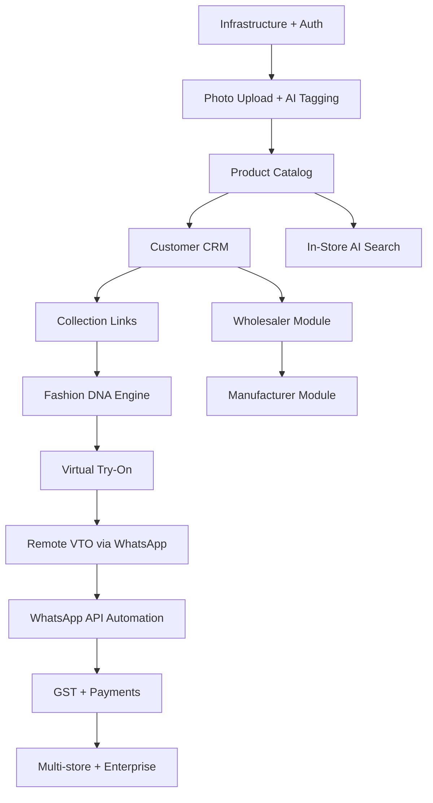

# Kanchuki — Project Roadmap & Build Plan

**Version:** 1.0  
**Date:** June 2026  
**Total Timeline:** 18 months (MVP → Full Platform)

---

## Phase Overview

```
Phase 0: MVP           Month 1–4    Digitize store + WhatsApp collections
Phase 1: AI Core       Month 5–8    Fashion DNA + Virtual Try-On
Phase 2: B2B Network   Month 9–12   Wholesaler/Manufacturer layer
Phase 3: Full Commerce Month 13–18  WhatsApp automation + payments + GST + multi-store
```

---

## Phase 0: MVP (Month 1–4)

**Goal:** 50 paying retailers, prove product-market fit  
**Revenue target:** First ₹50,000 MRR by Month 4  
**Team:** 2 developers, 1 designer, 1 founder doing sales

### Month 1: Foundation

**Week 1–2: Infrastructure Setup**
- [x] PostgreSQL 16 + pgvector on Railway/Supabase
- [x] Redis for cache + job queue (BullMQ + ioredis wired in API)
- [x] Cloudflare R2 bucket for images (presigned upload/download in @kanchuki/ai)
- [x] Supabase Auth (phone OTP)
- [x] Node.js + Fastify API scaffold
- [x] Next.js 14 customer web scaffold
- [x] React Native (Expo) retailer app scaffold
- [ ] CI/CD pipeline — CI done (`.github/workflows/ci.yml`: lint/typecheck/test/build); CD to Railway pending
- [x] Environment config (.env structure, secrets management)
- [x] Basic logging (Pino)

**Week 3–4: Auth + Onboarding**
- [x] Phone OTP login for retailers (Supabase Auth)
- [x] Retailer registration: shop name, city, category, GSTIN
- [x] Store structure setup (racks/shelves — customizable)
- [x] Onboarding flow (guided 6-step setup)
- [x] Basic retailer dashboard shell

**Deliverable:** Retailer can create account and set up store structure

---

### Month 2: Product Catalog

**Week 5–6: Photo Upload + AI Tagging**
- [x] Camera + gallery upload in React Native
- [x] Image compression (client-side, < 500KB)
- [x] Upload to Cloudflare R2 via presigned URL
- [x] Claude Vision API call for auto-tagging
- [x] AI tag review + edit UI
- [x] Product save to PostgreSQL

**AI Tagging Prompt Design:**
- Extract: category, type, primary_color, secondary_colors[], fabric_estimate, pattern, embellishments[], neck_style, sleeve_type, occasion[], price_range_visible, design_notes, search_tags[]
- Must understand Indian ethnic wear vocabulary
- Return structured JSON

**Week 7–8: Catalog Features**
- [x] Product list view (grid + list toggle)
- [x] Product detail view
- [x] Store location assignment (Floor → Section → Rack → Shelf)
- [x] Product status (Available / Sold / Reserved)
- [x] Basic search by tag (client-side filter for MVP)
- [ ] Bulk photo import (multiple images)

**Deliverable:** Retailer can build full digital catalog with AI assistance

---

### Month 3: Customer CRM + Collection Links

**Week 9–10: Customer Module**
- [x] Add customer (name, phone, preferences)
- [x] Customer list + search
- [x] Customer profile with preference tags
- [x] Purchase history (manual entry)

**Week 11–12: WhatsApp Collection Links**
- [x] Product selection UI (checkboxes on catalog)
- [x] Collection creation: title, description, expiry
- [x] Collection page (Next.js SSG/ISR) — unique URL per collection
- [x] Collection view: product grid, filter, sort
- [x] Favorite (heart) button — stored in localStorage, no login needed
- [x] Enquiry button → pre-filled WhatsApp deep link to retailer
- [x] Retailer view: collection analytics (views, enquiries)

**Deliverable:** Retailer can share product collections via WhatsApp link

---

### Month 4: AI Search + Polish + Launch

**Week 13–14: In-Store AI Search**
- [x] Generate pgvector embeddings on product save (background job)
- [x] Semantic search endpoint (cosine similarity on product embeddings)
- [x] Natural language query → structured + semantic hybrid search
- [x] Results ranked by relevance + price filter
- [x] Hindi transliteration support (basic — map common words)

**Week 15–16: Polish + MVP Launch**
- [ ] Performance optimization (load time < 3s on 3G)
- [ ] Error handling + offline resilience
- [ ] Onboarding tutorial improvements based on 10-retailer pilot
- [ ] Analytics dashboard (basic metrics)
- [ ] Razorpay subscription integration (14-day trial)
- [ ] Basic admin panel (retailer list, usage stats)
- [ ] Public landing page (Next.js)
- [ ] Pilot with 10 retailers, collect feedback, fix critical issues

**Deliverable:** MVP live, 50 retailer target

---

## Phase 1: AI Core (Month 5–8)

**Goal:** Add Fashion DNA + Virtual Try-On, reach ₹3L MRR  
**Prerequisite:** 3+ months of retailer + customer behavior data from Phase 0

### Month 5–6: Fashion DNA Engine

**Customer Behavior Collection (retroactive from Phase 0 data):**
- Products favorited from collection links
- Products enquired about
- Dwell time on product (link analytics)
- Explicit preferences (from CRM)

**Fashion DNA Model:**
- Preference vector per customer: color affinities, style affinities, budget range, occasion matrix
- Vector stored in pgvector (1536-dim)
- Updated on every interaction

**AI Matching Features:**
- "Products this customer will love" — retailer can view for any customer
- Auto-suggest collection: AI picks best 12 products for specific customer
- "Customers who might like this product" — reverse matching

### Month 7–8: Virtual Try-On

**Tech Choice:**
- Primary: FASHN API (fashion-specific, better ethnic wear quality)
- Fallback: Replicate IDM-VTON
- Quality gate: 80% acceptance rate on 50-sample ethnic wear test panel

**VTO Flow (Phase 1 — In-Store):**
1. Retailer selects product(s) customer wants to try
2. Customer takes selfie on retailer's tablet
3. AI generates try-on (15–30 seconds)
4. Result shown on tablet/external display (TV mode)
5. Customer can save/share result image

**VTO Flow (Phase 1 — Remote via WhatsApp Manual):**
1. Customer receives collection link
2. Selects product, sees "Try This On" button
3. Uploads their photo (with consent modal)
4. AI generates result (queued job, < 2 min)
5. Result delivered via page + WhatsApp notification to retailer who forwards it

**Cost control:**
- Try-on credits system (bundled in plans)
- Real-time credit count shown to retailer
- Low-credit warning at 20% remaining

---

## Phase 2: B2B Supply Network (Month 9–12)

### Month 9–10: Wholesaler Module

- Wholesaler account type (separate onboarding)
- Bulk catalog upload (ZIP, CSV, PDF)
- Retailer network management (invite/accept)
- Catalog sharing with price override capability
- Order interest tracking (retailer marks interest → wholesaler notified)

### Month 11–12: Manufacturer Module

- Manufacturer account type
- Master catalog upload with design numbers
- Design popularity analytics (which designs viewed/ordered most)
- Access control: share only with approved wholesalers
- Catalog watermarking (prevent unauthorized distribution)

---

## Phase 3: Full Commerce (Month 13–18)

### Month 13–14: WhatsApp Business API Automation

- Meta Cloud API integration
- Automated collection delivery (retailer schedules, system sends)
- Automated follow-up messages
- Customer opt-in/opt-out management
- Conversation inbox for retailer
- Meta conversation fee pass-through billing

### Month 15–16: Payments + GST

- UPI payment link generation per order (Razorpay)
- Order confirmation + receipt
- **GST invoice generation (CRITICAL)**:
  - GSTIN validation
  - HSN code mapping for apparel
  - B2C + B2B invoice formats
  - GSTR-1 export
- Advance booking / deposit collection

### Month 17–18: Enterprise Features

- Multi-store management (1 retailer, multiple shop branches)
- Multi-staff roles (owner / salesperson / admin)
- Regional language UI: Hindi (priority), Gujarati, Punjabi
- Advanced analytics: customer lifetime value, product performance, seasonal trends
- API for third-party integrations (accounting tools, POS)

---

## Technology Build Order



---

## Milestones & Success Gates

| Milestone | Month | Gate Criteria |
|-----------|-------|--------------|
| Infrastructure ready | M1 | Deploy endpoint responds, DB seeded |
| AI tagging working | M2 | 80% tag accuracy on 50-image test set |
| First retailer onboarded | M2 | Retailer uploads 20+ products |
| Collection link live | M3 | Customer opens link on mobile, enquires |
| MVP beta | M4 | 10 pilot retailers, real feedback |
| MVP public | M4 | 50 paying retailers |
| Fashion DNA live | M6 | 1000+ customer behavior events, matching visible |
| VTO in-store | M8 | 80% try-on quality on ethnic wear test panel |
| Wholesaler beta | M10 | 5 wholesalers sharing catalogs with retailers |
| WhatsApp automation | M14 | 100 retailers using automated sends |
| GST compliance | M16 | GST invoice generated for every sale |
| Regional languages | M18 | Hindi UI live, Gujarati in beta |

---

## Resource Plan

### Team (MVP — Month 1–4)
- **1 Full-Stack Dev** — Backend API + DB (Node.js + PostgreSQL)
- **1 Frontend Dev** — React Native app + Next.js customer web
- **1 Designer** — UI/UX (Figma), mobile-first
- **1 Founder** — Sales, retailer onboarding, product decisions

### Team (Phase 1 — Month 5–8)
- Add: **1 ML/AI Engineer** — Fashion DNA model, VTO integration
- Add: **1 QA/DevOps** — Testing, monitoring, CI/CD

### Team (Phase 2–3 — Month 9–18)
- Add: **1 Backend Dev** — B2B supply chain, WhatsApp API
- Add: **1 Business Dev** — Wholesaler/manufacturer partnerships

---

## Risk Mitigation

| Risk | Mitigation |
|------|-----------|
| VTO quality unacceptable | Test on 50 ethnic wear samples before shipping; have FASHN + Replicate fallback |
| Retailer upload behavior drops off | Gamify (streak, leaderboard), offer human onboarding support for first 50 products |
| WhatsApp API account ban | Build SMS fallback (MSG91) from Day 1; never spam |
| AI tagging cost spike | Cache embeddings; batch process; use Claude Haiku for bulk |
| Meta API pricing change | Decouple WhatsApp module behind feature flag; SMS/email always available |
| Competitor replication | Speed to market + deep ethnic wear quality + retailer network effects |
| Jio/Reliance entry | Focus on Tier 2–3 cities where distribution advantage is smaller |

---

## Budget Estimates (MVP — 4 months)

| Category | Monthly | 4-Month Total |
|----------|---------|--------------|
| Infrastructure (Railway/Supabase/R2/Cloudflare) | ₹15,000 | ₹60,000 |
| Claude Vision API (AI tagging, 500 retailers × 100 products) | ₹20,000 | ₹80,000 |
| Razorpay setup | ₹0 (% of txn) | ₹0 |
| Developer salaries (2) | ₹2,00,000 | ₹8,00,000 |
| Designer | ₹75,000 | ₹3,00,000 |
| Marketing/Sales | ₹50,000 | ₹2,00,000 |
| **Total** | **₹3,60,000** | **₹14,40,000** |

**Break-even:** 145 Growth plan retailers (₹2,499 × 145 = ₹3,62,355/month)
