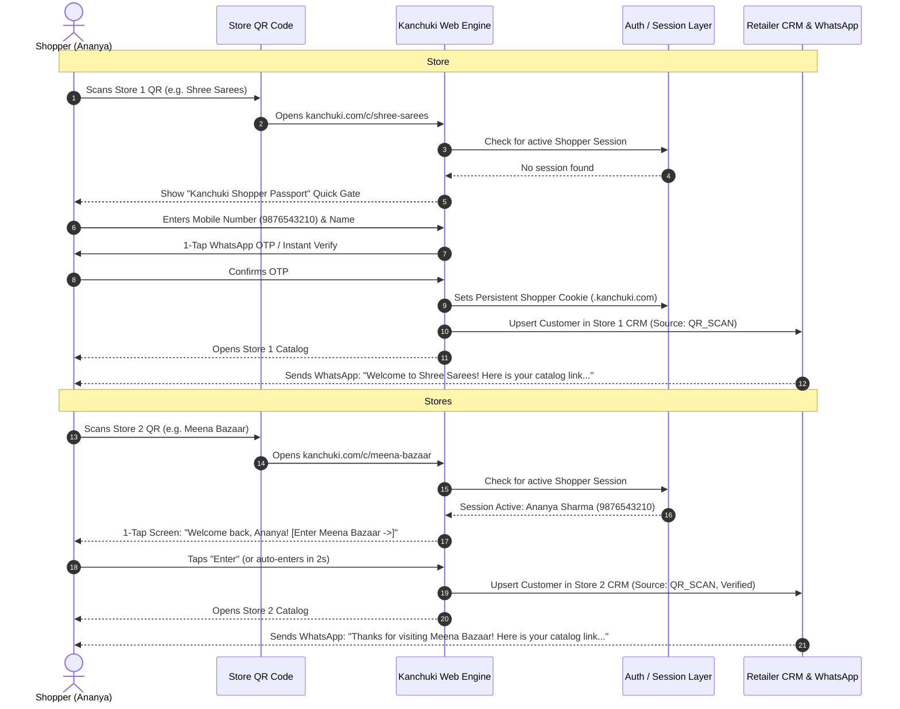

# Customer Phone Number & Universal QR Profile Architecture

**Document:** `docs/customer/customer-qr-identity-solution.md`  
**Date:** 2026-08-30  
**Status:** Research & Architecture Proposal  
**Context:** Extension of `docs/customer/customer-profile-req.md` (Unified Identity / Option C)

---

## 1. Executive Summary & Problem Definition

### 1.1 The Problem

In offline ethnic wear shopping hubs (e.g., Chandni Chowk, Commercial Street, T. Nagar, Bapu Bazaar), a customer typically walks into **5 to 10 boutiques** in a single afternoon.

Under a siloed per-store model:

- **Severe Friction:** Scanning 10 retailer QR codes requires the customer to type their Name, Phone Number, and Gender **10 separate times** on their mobile keyboard.
- **Privacy Hesitation:** Customers feel reluctant to hand over their raw phone number to 10 individual shopkeepers just to look at available designs.
- **High QR Bounce Rate:** 65–75% of shoppers drop off when confronted with a mandatory form before they have seen a single piece of inventory.
- **Dirty Lead Data:** Shoppers type fake numbers (e.g., `9899999999`) to bypass the gate, filling retailer CRMs with junk leads.

### 1.2 The Solution: "Kanchuki Shopper Passport" (Universal Shopper Identity)

Instead of forcing the customer to register with each retailer separately:

1. **Add Phone Once:** The customer verifies their mobile number **once** with Kanchuki at the first boutique they visit (or beforehand online).
2. **Instant 1-Tap Entry for Stores 2 to 10:** When the customer scans the QR code at any subsequent partner boutique, Kanchuki recognizes their existing session. With **zero typing** (or 1-tap confirmation), the catalog opens instantly.
3. **Automated Store Logging:** Kanchuki automatically logs the visit in the customer's personal profile ("Visited Boutiques") and records the walk-in lead in that specific retailer's CRM.
4. **Automated WhatsApp Catalog Dispatch:** Kanchuki enables the visited retailer to automatically send their catalog link / welcome message to the customer's WhatsApp, giving the retailer a high-intent, verified lead while giving the customer a hassle-free browsing trail.

---

## 2. End-to-End User Experience (UX Flow)



---

## 3. Step-by-Step Breakdown: Store 1 vs Stores 2–10

### 3.1 Store #1: Frictionless First-Time Onboarding

1. **Scan:** Customer scans QR code on the counter/mannequin/standee.
2. **Landing Screen:** Clear, premium co-branded screen:
   - _Header:_ Boutique Name + Logo (e.g., **Shree Sarees**)
   - _Value Pitch:_ _"Enter mobile number once to unlock digital catalogs across 500+ designer boutiques with your Kanchuki Passport."_
   - _Inputs:_ Name (optional / prefilled), Mobile Number (10 digits), Gender (optional).
   - _Consent:_ Checkbox (default checked): _"I agree to Kanchuki terms and sharing my contact with visited boutiques for WhatsApp updates."_
3. **Verification (OTP Rail):**
   - Instant OTP sent via WhatsApp / SMS (using MSG91 / Supabase Auth rail).
   - WhatsApp OTP has 98%+ delivery in India and 1-tap auto-read on mobile browsers.
4. **Session Persistence:**
   - On successful verification, a secure, `HttpOnly`, `SameSite=Lax` cookie is issued under the root domain (`.kanchuki.com`), valid for **90 to 180 days**.
   - `localStorage` holds a lightweight non-sensitive shopper identifier (`kanchuki_shopper_name`, `kanchuki_shopper_phone_masked`).

### 3.2 Stores #2 to #10: Zero-Friction Returning Visit

1. **Scan:** Customer walks into Boutique #2 (e.g., **Meena Bazaar**) and scans their QR code.
2. **Instant Recognition:**
   - The browser loads `kanchuki.com/c/meena-bazaar`.
   - The root cookie immediately validates the shopper session.
3. **Smart 1-Tap Entry Screen (Best Practice):**
   - Instead of asking for phone number again, the screen shows:
     > **Welcome back, Ananya! ✨**  
     > _You're entering Meena Bazaar._  
     > 🔘 _Share contact for WhatsApp catalog & updates_ `[Checked]`  
     > **[ Enter Catalog -> ]**
   - _Alternative "Zero-Click" mode:_ Catalog opens immediately with a gentle top banner: _"Browsing as Ananya (98765-XXXXX) • Store added to your Visited list [Change]"_.
4. **Background Data Sync:**
   - Store #2 is added to Ananya's `visited_stores` array.
   - Ananya is created/linked as a verified lead in Store #2's retailer dashboard.
   - Store #2's automated WhatsApp welcome trigger fires.

---

## 4. Retailer Dynamic & Value Proposition

### 4.1 Will Retailers Object to "Registering with Kanchuki"?

Shopkeepers care about **leads and sales**, not owning an isolated auth silo. When explained correctly, this model is a massive upgrade for retailers:

| Factor                     | Siloed Per-Store Form                  | Kanchuki Universal Passport                                       | Retailer Benefit                                            |
| -------------------------- | -------------------------------------- | ----------------------------------------------------------------- | ----------------------------------------------------------- |
| **QR Conversion Rate**     | 20–30% (70%+ bounce at phone prompt)   | **85–92%** (1-tap entry)                                          | **3x to 4x more walk-in leads** captured                    |
| **Data Quality**           | Frequent fake numbers (`99999...`)     | 100% verified Indian mobile numbers                               | No wasted WhatsApp marketing spend                          |
| **Customer Willingness**   | Low (fear of spam from unknown shops)  | High (trusted platform passport)                                  | Lower customer friction at the door                         |
| **Retailer CRM Ownership** | Retailer sees only what customer typed | Retailer gets verified name, phone, visit timestamp, viewed items | Richer customer context                                     |
| **Catalog Dispatch**       | Manual or delayed                      | **Automated WhatsApp link sent on QR scan**                       | Immediate digital follow-up while customer is in/near store |

### 4.2 How the Retailer Receives & Uses the Customer's Phone Number

1. **Instant Lead Alert:** When the customer scans the QR, the retailer's mobile app receives a notification: _"New walk-in visitor: Ananya Sharma (9876543210) is browsing your catalog via QR."_
2. **Automated WhatsApp Follow-Up:** Kanchuki's backend triggers a WhatsApp message from the retailer's business channel:
   > _"Hi Ananya! Thank you for visiting Meena Bazaar today. Here is our live digital catalog to browse anytime: https://kanchuki.com/c/meena-bazaar. Reply to this message for custom sizing, trial room assistance, or home delivery!"_
3. **Store CRM Integration:** Ananya appears in the retailer's `Customers` tab under `Source: QR_SCAN` with tag `#WalkIn`. The retailer can add notes (e.g., _"Interested in bridal lehengas under ₹50k"_), record measurements, or send curated collections.

---

## 5. Privacy, Consent & DPDP Act 2023 Compliance

India's **Digital Personal Data Protection (DPDP) Act 2023** mandates strict consent, notice, and deletion mechanisms. The Universal Passport model satisfies these requirements cleanly:

### 5.1 Clear Notice & Purpose Limitation

- **At Registration:** The customer is informed: _"Kanchuki stores your mobile number to create your universal shopping profile and shares your contact with boutiques whose QR codes you scan to enable WhatsApp catalog sharing and order updates."_
- **Per-Store Consent:** At each new store scan, the 1-Tap Entry screen provides a clear opt-in toggle for WhatsApp messaging from that specific store.

### 5.2 Granular Customer Controls (Customer Profile Hub)

Customers can visit `kanchuki.com/my-profile` or `kanchuki.com/my-stores` at any time to:

1. **View Visited Stores:** See all 10 boutiques scanned with date/time of visit.
2. **Mute/Unmute Stores:** Toggle off WhatsApp communications from Store #3 without affecting Store #1 or Store #2.
3. **Download / View Data:** View saved measurements, wishlist, and recent browsing history.
4. **1-Tap Account Deletion (Right to be Forgotten):** Revoke universal profile and anonymize phone number across Kanchuki platform.

---

## 6. Technical & Database Architecture

To support universal shopper identity while preserving individual retailer tenant isolation, the data model introduces a **Global Shopper Account** layer sitting above the existing **Retailer-Scoped Customer** records.

```
                    +------------------------+
                    |    CustomerAccount     |
                    | (Universal Shopper ID) |
                    |   phone: +919876543210 |
                    |   name: Ananya Sharma  |
                    |   auth_user_id: uuid   |
                    +-----------+------------+
                                |
        +-----------------------+-----------------------+
        |                       |                       |
        v                       v                       v
+---------------+       +---------------+       +---------------+
| CustomerStore |       | CustomerStore |       | CustomerStore |
|     Visit     |       |     Visit     |       |     Visit     |
| Retailer: #1  |       | Retailer: #2  |       | Retailer: #10 |
| Count: 3      |       | Count: 1      |       | Count: 1      |
| Consent: true |       | Consent: true |       | Consent: true |
+-------+-------+       +-------+-------+       +-------+-------+
        |                       |                       |
        v                       v                       v
+---------------+       +---------------+       +---------------+
|   Customer    |       |   Customer    |       |   Customer    |
| (Retailer #1) |       | (Retailer #2) |       | (Retailer #10)|
| Retailer CRM  |       | Retailer CRM  |       | Retailer CRM  |
| Notes/Orders  |       | Notes/Orders  |       | Notes/Orders  |
+---------------+       +---------------+       +---------------+
```

### 6.1 Proposed Schema Additions (Prisma)

```prisma
// --- 1. UNIVERSAL SHOPPER IDENTITY (Global, Cross-Retailer) ----------
model CustomerAccount {
  id           String    @id @default(cuid())
  auth_user_id String?   @unique // Supabase auth.users.id (if full auth enabled)
  phone        String    @unique // E.164 format: +919876543210
  phone_hash   String    @unique // SHA-256 for fast lookup / privacy indexing
  name         String?
  gender       Gender?
  email        String?
  city         String?
  state        String?
  usual_size   String?   // S, M, L, XL, 2XL (feeds AI recommendations across stores)

  is_verified  Boolean   @default(true)
  created_at   DateTime  @default(now())
  updated_at   DateTime  @updatedAt

  // Relationships
  store_visits     CustomerStoreVisit[]
  retailer_links   Customer[]             // Linked retailer CRM records
  fashion_dna      CustomerGlobalFashionDNA?
  wishlist_items   CustomerWishlistItem[]

  @@map("customer_accounts")
}

// --- 2. STORE VISIT & CONSENT TRACKER --------------------------------
model CustomerStoreVisit {
  id                  String    @id @default(cuid())
  customer_account_id String
  retailer_id         String

  source              CustomerLeadSource @default(QR_SCAN) // QR_SCAN | WHATSAPP_LINK | DIRECT_WEB
  first_visited_at    DateTime           @default(now())
  last_visited_at     DateTime           @default(now())
  visit_count         Int                @default(1)

  // WhatsApp consent per individual store
  whatsapp_consent    Boolean   @default(true)
  whatsapp_consent_at DateTime  @default(now())
  is_muted            Boolean   @default(false) // Customer opted out of this store's WhatsApps

  customer_account    CustomerAccount @relation(fields: [customer_account_id], references: [id], onDelete: Cascade)
  retailer            Retailer        @relation(fields: [retailer_id], references: [id], onDelete: Cascade)

  @@unique([customer_account_id, retailer_id])
  @@index([retailer_id, last_visited_at])
  @@map("customer_store_visits")
}

// --- 3. EXISTING CUSTOMER MODEL (TENANT CRM) - LINKED TO ACCOUNT -----
// In model Customer:
// Add:
// customer_account_id String?
// customer_account    CustomerAccount? @relation(fields: [customer_account_id], references: [id])
```

---

## 7. Cross-Store Session Persistence & Domain Architecture

A critical technical question is: **How does the customer's phone session stay active when scanning 10 different QR codes?**

### 7.1 Same-Domain Routing (Recommended & Current Architecture)

In Kanchuki's architecture, all retailer public storefronts live under the primary web domain:

- `kanchuki.com/c/[store-slug]` or `kanchuki.com/[store-slug]` (e.g., `kanchuki.com/shree-sarees`, `kanchuki.com/meena-bazaar`).
- **Cookie Mechanics:** Because all storefronts share the exact same root domain (`kanchuki.com`), an authentication cookie (`kanchuki_shopper_session`) set at Store #1 is **automatically sent by the browser** to Store #2, Store #3, and Store #10.
- **Result:** No complex third-party cookie workarounds or redirect loops required. Standard browser cookies work flawlessly.

### 7.2 Subdomain Routing (`store.kanchuki.com`)

If retailers have subdomains (e.g., `shreesarees.kanchuki.com` and `meenabazaar.kanchuki.com`):

- Set the cookie with `Domain=.kanchuki.com`.
- The cookie is automatically shared across all subdomains.

### 7.3 In-App QR Scanner Edge Case (Paytm / GPay / Instagram)

- **Challenge:** If a user scans QR code using Paytm or Google Lens, it might open in an isolated In-App Browser (WebView) that doesn't share cookies with Chrome/Safari.
- **Handling:**
  1. On the first scan in that WebView, they enter phone + OTP once. The session persists in that WebView's storage for subsequent scans.
  2. Provide a **"1-Tap Login with WhatsApp"** button (`wa.me/919999999999?text=Login_XYZ`) which verifies identity in 1 second without typing SMS OTP codes.
  3. Offer an **"Open in Chrome/Safari"** prompt for optimal experience.

---

## 8. Summary Comparison: Current vs Proposed Solution

| Feature                 | Current Implementation (`ContactGate.tsx`)                | Proposed Universal Passport (`customer-qr-identity-solution.md`) |
| ----------------------- | --------------------------------------------------------- | ---------------------------------------------------------------- |
| **Form at Store 1**     | Name, Phone, Gender, Consent                              | Name, Phone, Instant OTP (Creates Kanchuki Passport)             |
| **Form at Stores 2–10** | Repeats full form every single store                      | **Zero typing** (1-Tap "Enter [Store Name]")                     |
| **Session Lifetime**    | LocalStorage keyed to `leadKey(slug)` (single store only) | Root Session Cookie valid for **90+ days across all stores**     |
| **Retailer CRM**        | Independent `Customer` row created                        | Linked `Customer` row + verified walk-in lead entry              |
| **Retailer WhatsApp**   | Dependent on manual retailer outreach                     | **Automated catalog link dispatch on scan**                      |
| **Customer Experience** | Repetitive, annoying, spam-prone                          | Seamless, premium, gives a "VIP Passport" feeling                |
| **Customer Hub**        | None (no way to see past visited stores)                  | `/my-stores` showing all scanned boutique catalogs               |
| **DPDP Compliance**     | Basic checkbox                                            | Full audit trail, per-store consent toggles, 1-tap revocation    |

---

## 9. Implementation Roadmap

### Phase 1: Universal Cookie & 1-Tap QR Entry (Quick Win)

- Create `CustomerAccount` & `CustomerStoreVisit` tables.
- Update `ContactGate.tsx`:
  - Check for universal session cookie (`kanchuki_shopper_session`).
  - If found: display 1-Tap Entry screen (_"Welcome back, [Name]"_), log `CustomerStoreVisit`, and enter catalog immediately.
  - If not found: collect phone + OTP, create `CustomerAccount`, set cookie, and proceed.
- Link captured lead to retailer's `Customer` CRM table.

### Phase 2: Automated WhatsApp Welcome & Catalog Dispatch

- Connect QR visit event to Meta WhatsApp Business API / MSG91 webhook.
- Send instant personalized catalog link to shopper's WhatsApp upon QR entry.

### Phase 3: Shopper Profile Hub & Cross-Store Features

- Launch `kanchuki.com/my-stores` where customers can browse all previously scanned stores.
- Enable cross-store universal wishlist and unified `CustomerFashionDNA` recommendations.
- Add granular WhatsApp notification preference controls.

---

## 10. Conclusion & Recommendation

Creating a **Kanchuki Universal Shopper Profile** is the right product decision. It transforms QR scanning from a high-friction gatekeeper into a seamless **1-Tap Shopper Passport**.

- The customer only enters and verifies their phone number **once**.
- Across all subsequent boutiques, the customer enters catalogs instantly with zero typing.
- Retailers receive verified, high-converting walk-in leads and can instantly send their catalog via WhatsApp.
- The platform gains valuable network effects and cross-store shopper engagement while adhering strictly to Indian data privacy regulations.
