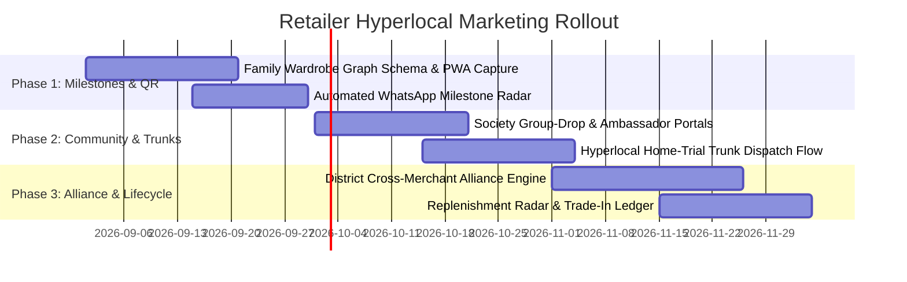

# Hyperlocal Retail Marketing & Customer Acquisition Blueprint

## 5 High-Impact, Radius-Centric Growth Engines for Independent Fashion Retailers

**Document Type:** Strategic Research & Product Feature Blueprint  
**Target Audience:** Independent Fashion Retailers, Boutique Owners, Regional Apparel Store Chains  
**Geographic Scope:** Hyperlocal Radius (3–10 km) & Single-District Catchment Areas  
**Target File:** `docs/customer/marketing-ideas.md`

---

## Executive Summary: The Local Retail Dilemma

Local fashion and apparel retailers in India and emerging markets face a double squeeze:

1. **Marketplace Pitfalls (Amazon, Flipkart, Myntra, Meesho):**
   - **Exorbitant Return Rates:** 30–45% Return-to-Origin (RTO) and customer return rates erode margins.
   - **Zero Customer Ownership:** Retailers cannot access customer contact details, making repeat marketing impossible.
   - **High Commission & Listing Fees:** 15–30% platform take rates destroy net margins.
   - **Counterfeit & Trust Deficit:** High trust friction where online buyers fear substandard fabric, inaccurate sizing, or delayed refunds.
2. **Digital Ad Traps (Google Ads, Meta Ads / Facebook & Instagram Ads):**
   - **High Cost Per Acquisition (CPA):** Small retailers burn ₹5,000–₹25,000 monthly on clicks from users outside their delivery or travel radius.
   - **Vanity Impressions vs. Real Buyers:** Broad targeting generates likes, comments, and window-shoppers, but rarely converts to walk-ins or paid orders.
   - **Complex Ad Management:** Independent retailers lack dedicated media buyers or marketing agencies.

### The Hyperlocal Moat: Why Proximity Beats Platforms

Fashion is **tactile, personal, and time-sensitive**. Local retailers possess three structural advantages that national e-commerce algorithms can never replicate:

- **Instant Touch, Feel & Fit:** Zero ambiguity regarding fabric weight, color authenticity, and silhouette.
- **Same-Day Fulfilment & On-the-Spot Alterations:** Instant delivery or pickup with 15-minute tailor adjustments.
- **Relational Trust (The "Family Masterji / Trusted Shopkeeper" Effect):** Customers trust a merchant whose physical presence is in their community.

The key to unlocking massive revenue is **not broadcasting ads to strangers**, but building **systematic, software-driven pipelines** that capture neighborhood demand, leverage community networks, automate life-event milestones, and turn existing customers into recurring buyers.

```
┌─────────────────────────────────────────────────────────────────────────────┐
│                    THE 5 HYPERLOCAL GROWTH PILLARS                          │
├─────────────────────────────────────────────────────────────────────────────┤
│ 1. Occasion & Milestone Lifecycle Trigger (Family Wardrobe Graph)          │
│ 2. Society & Apartment Gated Group-Drop (Community Micro-Ambassadors)       │
│ 3. Hyperlocal VIP "Try-at-Home" Trunk Delivery (Zero-Return Commerce)       │
│ 4. District Merchant Alliance & Cross-Loyalty Passport                      │
│ 5. Wardrobe Replenishment & Seasonal Trade-In Exchange Engine               │
└─────────────────────────────────────────────────────────────────────────────┘
```

---

## Idea 1: Occasion & Milestone Lifecycle Trigger Engine

### (The Family Wardrobe Graph & Predictive Anniversary/Birthday Outreach)

### 1.1 The Core Insight

Clothing in local retail is rarely an impulse buy; **over 75% of high-margin ethnic and casual wear purchases are tied to calendar milestones**:

- Birthdays & Wedding Anniversaries
- Weddings, Engagements, and Pre-wedding Celebrations (Sangeet, Haldi)
- Religious Festivals, Pujas, Housewarmings (Griha Pravesh), Mundans
- School/College Annual Days, Convocation, Farewell Parties

National e-commerce platforms do not know when a customer's spouse's birthday or nephew's wedding is taking place. A local retailer with a structured **Family Wardrobe Graph** can predict buying intent weeks before the customer even begins searching.

### 1.2 Feature Architecture & Workflow

```
[Customer Onboarding / In-Store Scan]
               │
               ▼
   [Family Profile Capture]
   • Self & Spouse Birthdays / Anniversary
   • Kids' Ages & Birthdays
   • Upcoming Weddings / Major Family Events
               │
               ▼
 [Milestone AI Radar (15–21 Days Prior)]
               │
               ▼
[Personalized WhatsApp "Occasion Edit" Dispatch]
   • Direct catalog link with 5 tailored outfits in matching sizes
   • Exclusive Milestone Voucher (e.g., ₹500 off)
   • "Reserve in Trial Room" or "Same-Day Home Trial" CTA
               │
               ▼
   [Instant Store Visit / Home Order]
```

### 1.3 How the Retailer Executes

1. **Frictionless Milestone Capture:** When a customer visits or scans a QR code, the PWA offers a simple prompt: _"Add your family's special dates to unlock ₹500 off on every birthday & anniversary."_
2. **Automated Dynamic Catalog Generation:** 18 days before an anniversary, the system queries the catalog for trending couple wear or premium sarees in the customer’s preferred size range and budget.
3. **Hyper-Personalized WhatsApp Concierge Message:**
   > _"Namaste Rajesh ji! Aarti ji’s birthday is just 2 weeks away (Sep 18). We have curated 4 exclusive pure silk sarees that just arrived this week in her favorite pastel shades. Click here to see her private birthday edit with your special ₹500 anniversary credit. Would you like us to keep them ready in Trial Room 1 for your evening visit?"_
4. **VIP Trial Room Reservation:** Customer clicks a button to book a 30-minute private trial slot with complimentary tea/coffee.

### 1.4 Hyperlocal Radius & District Advantage

- **Target Radius:** 0–12 km (Walk-in or 30-minute drive).
- **Conversion Rate Lift:** 35–45% vs. 1.5% on cold digital ads.
- **Customer Lifetime Value (LTV):** Guarantees a minimum of 3–5 recurring purchases per family per year.

---

## Idea 2: Gated Society & Apartment "Group-Drop" Engine

### (Hyperlocal Micro-Ambassador & Community Wardrobe Pop-Up)

### 2.1 The Core Insight

Modern urban and semi-urban districts consist of dense residential clusters: high-rise gated societies, government colonies, residential welfare associations (RWAs), and township societies (500 to 5,000 families living within a 500-meter radius).

Within these societies, word-of-mouth spreads at lightning speed through **Society WhatsApp Groups, Telegram channels, and informal Mom/Kitty groups**. When one respected resident praises a local boutique or tailor, 20 others follow.

### 2.2 Feature Architecture & Workflow

```
[Retailer Sets Target Society (e.g., "Palm Heights, Sector 15")]
                               │
                               ▼
            [Identify / Invite Society Ambassador]
            (Active resident, fashion enthusiast, influencer)
                               │
                               ▼
        [Curate 48-Hour "Society Exclusive Wardrobe Drop"]
        (e.g., Pre-Diwali Kurta Sets, Kids Festive Edit)
                               │
                               ▼
     [Ambassador Shares Secret Link to Society WhatsApp Group]
                               │
                               ▼
       [Group Milestone Tiers: "If 10 Neighbors Buy, All Get 15% Off"]
                               │
                               ▼
       [Consolidated Weekend Society Delivery & Trunk Showcase]
```

### 2.3 How the Retailer Executes

1. **Society Geofenced Micro-Stores:** The retailer creates a dedicated, passwordless link for a specific apartment complex (e.g., `kanchuki.app/store/royal-palms-festive`).
2. **Dynamic Group-Buying Thresholds:**
   - 3 orders placed: Free matching dupatta or scarf for all.
   - 7 orders placed: 10% instant cashback for every buyer.
   - 15 orders placed: 15% discount + Free on-site alteration session in the society clubhouse.
3. **Resident Ambassador Perks:** The resident who coordinates receives 8–10% store credit or free designer outfits, turning influential homemakers into passionate brand champions without upfront salary costs.
4. **Society Trunk Van Pop-Up:** On Saturday morning, the retailer dispatches a branded delivery van to the society parking/clubhouse with the pre-ordered items plus 30 high-demand curated pieces for instant trial and purchase.

### 2.4 Hyperlocal Radius & District Advantage

- **Target Radius:** 1–5 km around the retail store.
- **Logistics Cost:** Zero per-order courier fees; all 15–30 orders delivered in a single 1-hour van trip.
- **Zero CAC Acquisition:** Captures dozens of verified affluent households in a single stroke.

---

## Idea 3: VIP "Try-at-Home" Trunk Delivery Engine

### (Zero-Return, High-Touch Hyperlocal Fitting Experience)

### 3.1 The Core Insight

The single biggest barrier to online fashion shopping is **fit and fabric hesitation**. Customers abandon digital shopping carts because they don't know if a size 'L' will fit their shoulders or if the fabric is soft.

Marketplaces attempt to solve this with 10-day return policies, resulting in broken items, high transit damage, and billions in return logistics. A local store 4 km away can offer **instant, supervised home trials** where the customer tries 5 garments, buys 2 on the spot, and hands 3 back immediately.

### 3.2 Feature Architecture & Workflow

```
[Customer Browses Store PWA / Digital Catalog]
                      │
                      ▼
        [Selects 4–6 Outfits for "Home Trunk"]
        (No upfront payment required / Small ₹99 refundable security)
                      │
                      ▼
    [Retailer Dispatch Partner / Store Staff Arrives in 60 Mins]
    (Brings portable garment bag + fabric swatches + tailor measuring tape)
                      │
                      ▼
            [15-Minute Home Trial Session]
                      │
                      ▼
[Instant UPI Payment for Selected Items + On-the-Spot Pinning for Alteration]
                      │
                      ▼
     [Immediate Return of Unselected Garments (Zero RTO Friction)]
```

### 3.3 How the Retailer Executes

1. **"Order a Trunk" Button on Catalog:** Customers select up to 5 outfits with their usual size + one backup size.
2. **Local Delivery Runner with Smart Bag:** A trained store delivery associate (or in-house staff) delivers the hanger bag within a scheduled 1-hour window.
3. **Instant Alteration Pinning:** If a kurta sleeve or waist needs a 1-inch cinch, the delivery associate pins it with tailor markers. The garment is altered back at the store and delivered back the same evening.
4. **Hyperlocal Batching:** The platform groups morning and evening trunk deliveries by district sectors to minimize travel time.

### 3.4 Hyperlocal Radius & District Advantage

- **Target Radius:** 3–8 km.
- **Conversion Rate:** 70–85% of home-trial trunks result in a sale of at least 1–3 items (compared to 2–3% e-commerce website conversion).
- **Return Rate:** Effectively **0% post-delivery returns**, because the trial happens _before_ payment.

---

## Idea 4: District Cross-Merchant Alliance & Loyalty Passport

### (The Non-Competing Neighborhood Merchant Circle)

### 4.1 The Core Insight

A customer who buys clothing in a district also spends money at **complementary, non-competing lifestyle merchants** in the same market:

- Women buying party wear also visit local **Beauty Parlors, Nail Salons, and Bridal Spas**.
- Men buying suits/jackets also visit **Men's Grooming Salons, Watch Showrooms, and Gyms**.
- Families buying festive clothes also shop at **Local Jewelry Stores, Footwear Boutiques, Sweet Shops, and Banquet Halls**.

Instead of buying cold Google or Facebook ads, local retailers can cross-pollinate verified, high-spending customers from neighborhood merchant partners.

### 4.2 Feature Architecture & Workflow

```
┌────────────────────────────────────────────────────────────────────────┐
│               DISTRICT LIFESTYLE MERCHANT ALLIANCE                     │
├───────────────────┬───────────────────┬────────────────────────────────┤
│ Clothing Boutique │ Bridal Hair Salon │ Jewelry Store │ Premium Sweets │
└─────────┬─────────┴─────────┬─────────┴───────┬───────┴────────┬───────┘
          │                   │                 │                │
          └───────────────────┼─────────────────┼────────────────┘
                              ▼
           [Unified Hyperlocal "District Shopping Passport"]
                              │
                              ▼
  [Customer spends ₹2,500 at Partner Bridal Salon]
                              │
                              ▼
  [Instant Automated WhatsApp Voucher Generated:
   "Get ₹600 off your Saree/Gown at Kanchuki Boutique (300m away)"]
                              │
                              ▼
  [Customer walks into Boutique same afternoon]
```

### 4.3 How the Retailer Executes

1. **Alliance Hub Setup:** The software allows 4–8 trusted neighborhood business owners to form a private "District Circle" on the platform.
2. **Automated Cross-Reward Triggers:**
   - Spend ₹1,500 at Partner Salon $\rightarrow$ Receive ₹400 voucher for Clothing Store.
   - Spend ₹5,000 at Clothing Store $\rightarrow$ Receive Free Grooming/Blow-dry voucher at Salon + ₹500 off at Jewelry Store.
3. **Shared Customer Trust Score:** Merchants see that the customer is a verified local spender who pays on time.
4. **Zero Cash Spend:** No money paid to Meta or Google. Customer acquisition is 100% financed through high-margin trade discounts.

### 4.4 Hyperlocal Radius & District Advantage

- **Target Radius:** 1–5 km (Same commercial market or neighboring high streets).
- **Customer Quality:** 100% high-intent, active local shoppers already holding shopping bags in that exact market.

---

## Idea 5: Smart Wardrobe Replenishment & Seasonal Trade-In Engine

### (Predictive Size-Progression & Circular Wardrobe Trade-In Days)

### 5.1 The Core Insight

Fashion is inherently cyclical and recurring:

- **Kids & Teens:** Outgrow sizes every 4 to 6 months.
- **Working Professionals:** Need new daily formal/casual wear shirts and trousers every 3 to 6 months due to wear and wash cycles.
- **Festive & Wedding Enthusiasts:** Sits with heavy lehengas or kurtas worn only once or twice, feeling guilty about buying new ones.
- **Seasonal Shifts:** Summer breathable cotton $\rightarrow$ Monsoon moisture-wicking $\rightarrow$ Winter thermal/jackets/shawls.

Instead of waiting for customers to remember the store, the system uses past purchase metadata to **predict when they need an upgrade** and offers an irresistible trade-in reason to return.

### 5.2 Feature Architecture & Workflow

```
[Past Purchase Database (Item, Category, Size, Date)]
                         │
                         ▼
        [Lifecycle Replenishment Algorithms]
    • Kids Size Radar: "Age + 6 months = Next Size Up"
    • Men's Workwear: "180 Days Since Last Oxford Shirt Purchase"
    • Seasonal Change: "Monsoon Ending -> Winter Festive Stock Arriving"
                         │
                         ▼
    [Trigger "VIP Wardrobe Upgrade & Trade-In" Invitation]
    • "Bring 2 old wearable garments for ₹600 Instant Upgrade Credit"
    • "Pre-reserve your size from new unreleased lot before open racks"
                         │
                         ▼
    [Customer Returns to Store -> Buys Higher-Ticket New Collection]
```

### 5.3 How the Retailer Executes

1. **AI Size-Progression Alert (Kids/Teens):**
   > _"Namaste Sunita ji! Master Aarav was size 28 in kids' ethnic wear during last Diwali. With festival season starting in 3 weeks, we have reserved 4 new size 32 festive kurta sets for him. Tap here to hold them for 48 hours."_
2. **Monthly "Old Clothes Trade-In Weekend":**
   - The retailer designates the first weekend of every month as "Wardrobe Refresh Days".
   - Customers bring in gently-used branded clothes in exchange for ₹200–₹500 instant store credit towards purchases above ₹1,999.
   - Retailer partners with local NGOs or upcycling textile units, earning immense local community goodwill and positive local PR.
3. **Exclusive VIP 24-Hour Rack Pre-Booking:**
   - 24 hours before new stock goes on public display, existing neighborhood customers get an exclusive PWA link to "claim" pieces in their size.

### 5.4 Hyperlocal Radius & District Advantage

- **Target Radius:** Entire District (5–15 km).
- **Retention Rate:** Increases annual customer retention from 20% to **65%+**.
- **Inventory Velocity:** Clears fresh collections within the first 72 hours of arrival.

---

## Comparison Matrix: Traditional Channels vs. 5 Hyperlocal Engines

| Dimension                           | Marketplaces (Amazon / Myntra)      | Digital Ads (Google / Meta)                 | The 5 Hyperlocal Engines                                        |
| ----------------------------------- | ----------------------------------- | ------------------------------------------- | --------------------------------------------------------------- |
| **Customer Acquisition Cost (CAC)** | High (15–30% platform take)         | Very High (₹350–₹1,200 per converted order) | **Near Zero (₹20–₹50 per lead via WhatsApp/Word of Mouth)**     |
| **Return / RTO Rate**               | 30% – 45%                           | 20% – 35%                                   | **Under 3% (Supervised trial & in-store alteration)**           |
| **Customer Data Ownership**         | Zero (Masked numbers/emails)        | Zero (Platform retains data)                | **100% Direct CRM Ownership (Phone, Family Dates, Sizing)**     |
| **Conversion Rate**                 | 1.5% – 3%                           | 0.8% – 2.2%                                 | **35% – 75% (Occasion & Home Trunk Trials)**                    |
| **Trust Factor**                    | Low / Suspicious of counterfeits    | Low / Skeptical of scam sites               | **Extremely High (Physical local shop, known in neighborhood)** |
| **Fulfilment Speed**                | 2 to 5 Days                         | 2 to 5 Days                                 | **30 Minutes to 2 Hours (Local Runner or Walk-in)**             |
| **Alteration / Custom Fit**         | None (Customer pays outside tailor) | None                                        | **Included (Same-day masterji alteration)**                     |

---

## Implementation Roadmap for Platform Builders (30–60–90 Day Plan)



### Days 1–30 (Pillar 1 & Foundation):

- Deploy in-store QR code lead capture with the **Family Occasion Vault** on the customer PWA.
- Build automated 18-day & 7-day milestone triggers connected to the WhatsApp Business API.
- Measure initial walk-in footfall from birthday/anniversary vouchers.

### Days 31–60 (Pillars 2 & 3):

- Roll out **Society Exclusive Group Drops** in 5 high-density residential towers within 3 km.
- Equip store staff with the **VIP Home Trunk Dispatch Kit** (portable garment rack, size markers, UPI QR).
- Onboard 3–5 society resident ambassadors.

### Days 61–90 (Pillars 4 & 5):

- Form the first **District Lifestyle Alliance** with 1 bridal salon, 1 jeweler, and 1 dry cleaner on the high street.
- Activate the **Size-Progression & Wardrobe Refresh Trade-In** campaigns before the upcoming festival peak.

---

## Conclusion & Strategic Takeaway

Small independent fashion retailers do not need to fight multi-billion-dollar tech giants at their own game (mass bidding on generic keywords or offering unsustainable free shipping across the country).

By mastering **hyperlocal proximity, family milestone awareness, gated community drops, supervised home trials, and cross-merchant alliances**, a local retailer can build an impenetrable, highly profitable moat that yields higher conversion rates, zero RTO losses, and loyal, multi-generational customer relationships.
